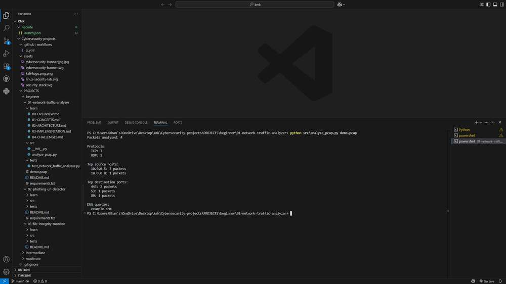

# Network Traffic Analyzer

A packet capture can contain thousands of records, but the first questions are often simple: which systems are talking, which protocols are common, and which destinations are being requested? This tool turns a saved PCAP into a short terminal report so you have somewhere to start your investigation.

## Run it

Open a terminal in this project directory. Use Python 3.12 or 3.13; the repository's [setup guide](../../../README.md#get-started-in-vs-code) explains virtual environments and dependency installation.

```console
python -m src.analyze_pcap capture.pcap
```

Supply an existing PCAP file captured in your own lab. The program reads the file; it does not start a capture or transmit packets. Install the dependencies in `requirements.txt` before running it.

## Read the result

The report shows the total number of packets, protocol counts, the ten busiest source addresses, the ten most common destination ports, and up to twenty DNS question names. Repeated names remain repeated because they represent separate queries. DNS replies are excluded from the query list, although they still contribute to packet and protocol totals.

## How the code works

`packet_to_record()` extracts the fields used by the report and puts them in a `TrafficRecord`. IPv4 and IPv6 addresses are supported. TCP and UDP packets retain their destination ports; other IP traffic falls back to `IP`, and unrecognized traffic to `OTHER`. `summarize_records()` uses counters to aggregate those records, while `print_summary()` handles presentation.

The [learning notes](learn/00-OVERVIEW.md) explain the concepts, implementation decisions, and tradeoffs in more detail.

## Try a small investigation

Start with a capture containing one DNS question and its reply. Expect two packets but one DNS query. Add a TCP connection and check that its destination port appears separately. This makes it easier to distinguish transport counts from application-level observations.

## Troubleshooting and scope

If Scapy is missing, install `requirements.txt` in the same Python environment you use to run the command. A missing or unreadable capture produces an error instead of an empty report. Some restricted containers block Scapy while it discovers network interfaces; run the analyzer on your workstation or a runner that permits that initialization.

This is a traffic summary, not an intrusion detector. A busy host or unusual port needs context before you can call it suspicious. Encrypted application content stays encrypted, and DNS names are available only when the capture exposes them. Scapy loads the capture into memory, so large captures may need to be split before analysis.

## Tests

From this project directory, install pytest and run the tests:

```console
python -m pip install pytest
python -m pytest -q tests
```

Tests use controlled inputs and temporary files where needed. They verify the behavior of the configured checks; they do not establish that every real-world threat or configuration is covered.

## Output reference



The command output depends on your input. Use the run instructions above to reproduce a report with your own data.
