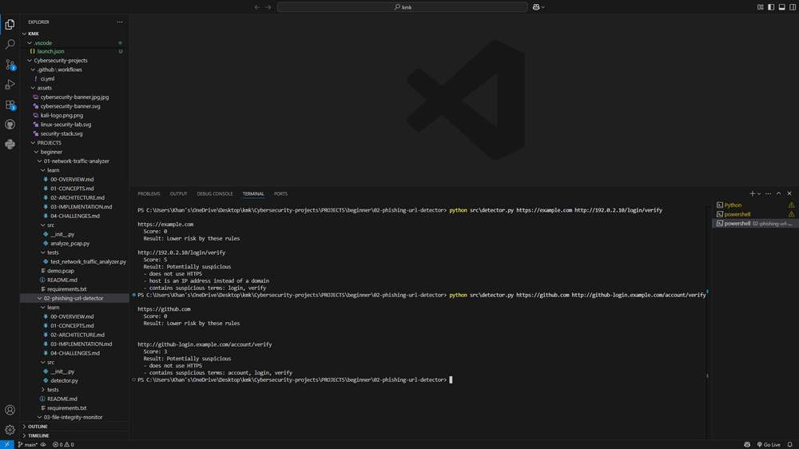

# Phishing URL Detector

This project explains why a URL might deserve a closer look. It uses a small set of visible clues and prints the reasons behind its score, making it useful for learning how deceptive addresses are structured.

## Run it

Open a terminal in this project directory. Use Python 3.12 or 3.13; the repository's [setup guide](../../../README.md#get-started-in-vs-code) explains virtual environments and dependency installation.

```console
python -m src.detector "https://example.com/about" "http://192.0.2.10/login/verify"
```

Pass one or more quoted URLs on the command line. Quotes keep characters such as `&` from being interpreted by your shell. The detector works offline: it does not resolve the host, open the page, or send the URL to a reputation service. Inputs without a scheme are treated as HTTP.

## Read the result

The first example scores zero under these rules. The second adds points for HTTP, an IP-address host, and credential-themed words. A score of three or more receives the label `Potentially suspicious`. A lower score means fewer matching clues; it does not mean the destination is safe.

## How the code works

`urlparse()` separates the address into components. The detector checks HTTPS use, missing or IP-based hosts, overall length, subdomain depth, `@` in the authority, and words such as login or verify. Each matching check adds a stated number of points and a human-readable reason. `URLResult` keeps the score and its explanation together.

The [learning notes](learn/00-OVERVIEW.md) explain the concepts, implementation decisions, and tradeoffs in more detail.

## Try a small investigation

Compare `https://example.com/about` with `http://192.0.2.10/login/verify`, then change one part at a time. Removing HTTP or a suspicious word should change the score for a reason you can explain. That is more useful than treating the final label as a verdict.

## Troubleshooting and scope

Malformed addresses, such as an unmatched IPv6 bracket, are reported individually. The command continues checking later inputs and exits with a nonzero status if any URL could not be parsed. Review the hostname yourself before visiting an unfamiliar address.

The score is a heuristic, not a probability. Legitimate login pages can trigger rules, and a malicious page can use a short, ordinary HTTPS address. The tool does not inspect page content, redirects, certificates, domain age, or lookalike Unicode characters.

## Tests

From this project directory, install pytest and run the tests:

```console
python -m pip install pytest
python -m pytest -q tests
```

Tests use controlled inputs and temporary files where needed. They verify the behavior of the configured checks; they do not establish that every real-world threat or configuration is covered.

## Output reference



The command output depends on your input. Use the run instructions above to reproduce a report with your own data.
