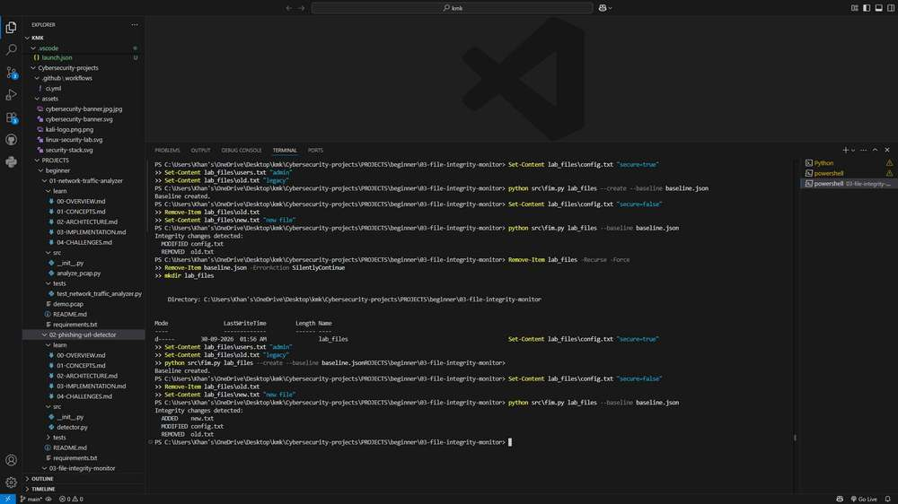

# File Integrity Monitor

## Overview

File Integrity Monitor creates a SHA-256 baseline for files in a folder and compares later scans with that baseline. It reports files as added, modified, or removed and stores the baseline as readable JSON.

