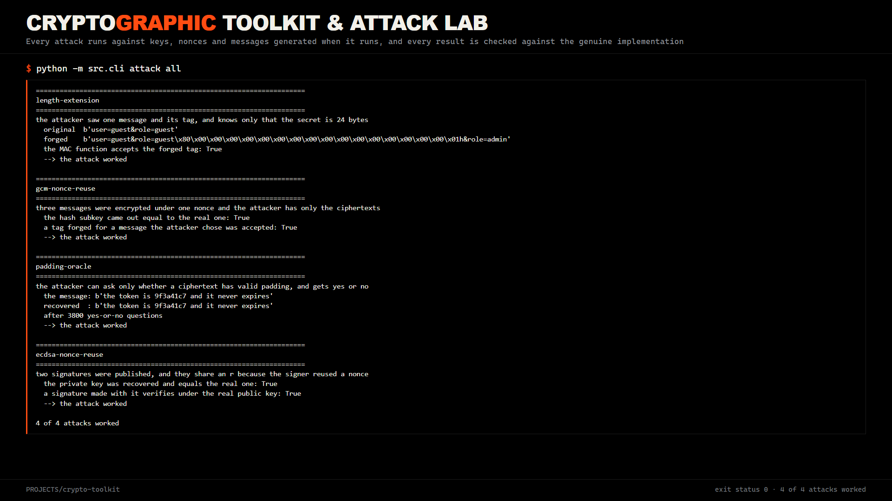
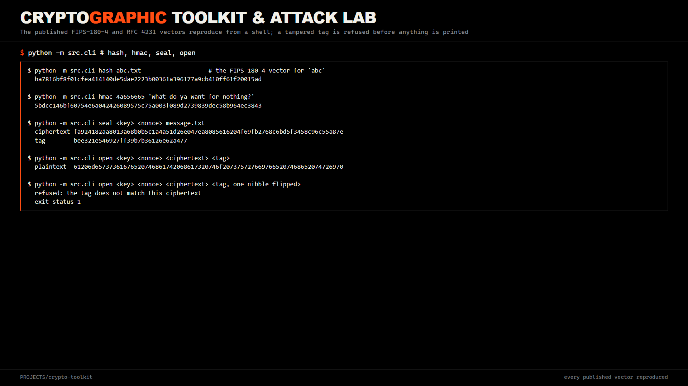
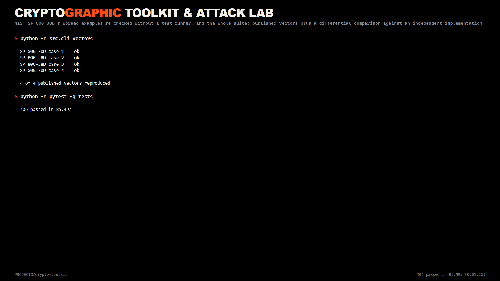
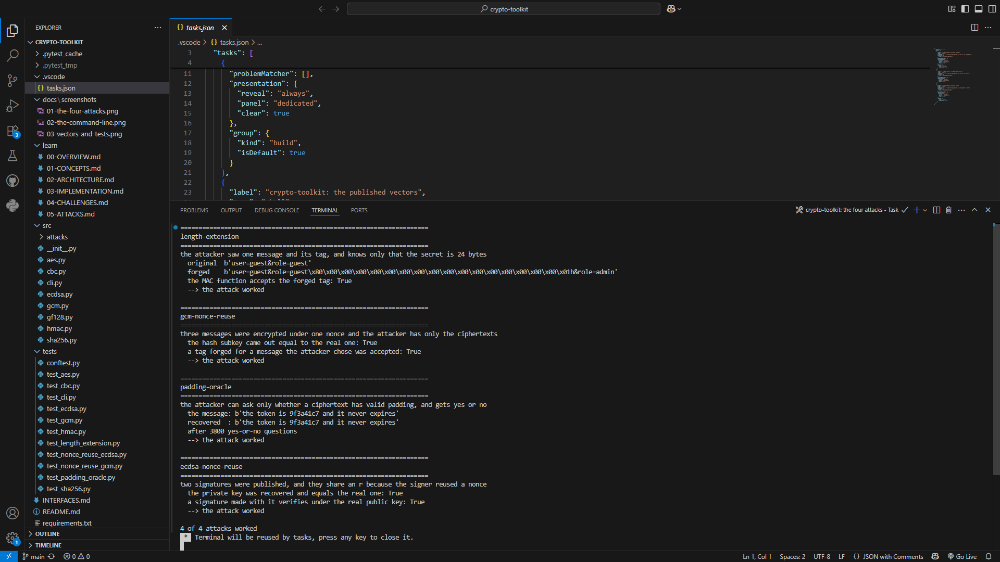
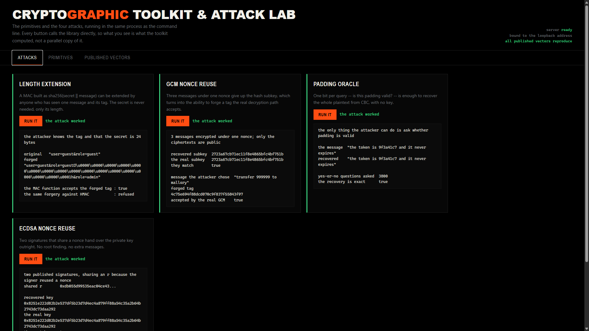
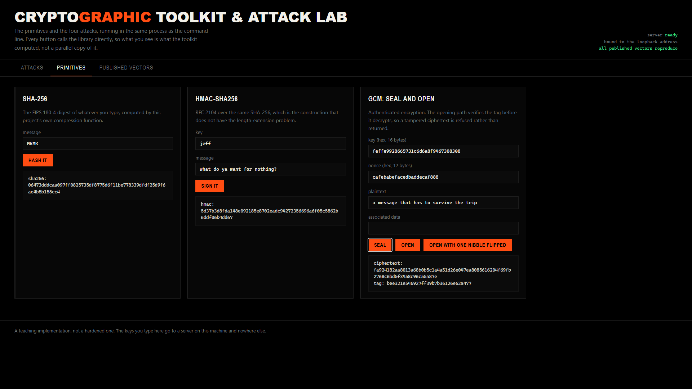
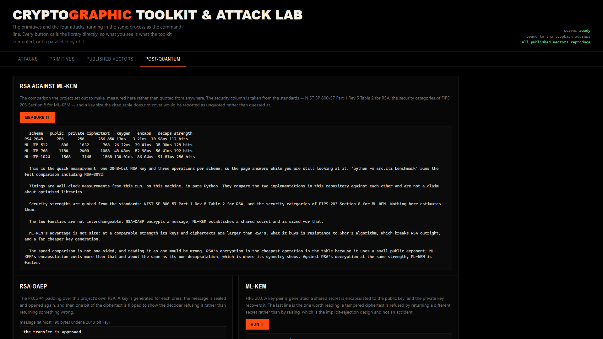
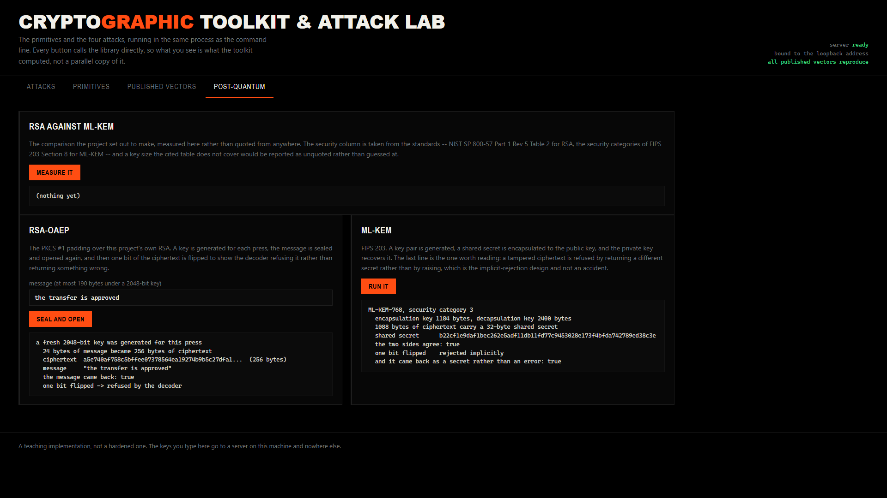

# Cryptographic toolkit and attack lab

A cryptographic library written from the primitives up, and the attacks that
break the naive versions of the same constructions. Nothing in `src/` imports a
cryptography package: AES is written out as a key schedule and a round
function, SHA-256 as a message schedule and a compression function, GCM as
counter mode bolted to a polynomial hash over GF(2**128), CBC as the same block
cipher chained, and ECDSA on an elliptic curve over a 256-bit prime field with
the point arithmetic spelled out. The point is not to replace a real library.
The point is that the arithmetic is visible, and that it can be checked against
the standards' own worked examples rather than taken on trust.

The second half is the reason to write the first half this way. Every attack in
`src/attacks/` is mounted against the code in this repository rather than
against a description of it, and every one of them is verified by recovering or
forging something and then checking it against the genuine implementation -- the
forged MAC is fed back into the MAC function, the forged GCM tag is accepted by
`GCM.decrypt`, the recovered ECDSA key is compared to the key that signed, and
the recovered plaintext to the plaintext that was encrypted. Nothing is
compared to a stored answer, and every key, nonce and message is generated when
the test runs.

## What is implemented

| Primitive | File | What it covers |
| --- | --- | --- |
| AES block cipher | `src/aes.py` | 128, 192 and 256-bit keys, encryption and decryption, the key schedule and the round function written out |
| Counter mode | `src/aes.py` | the AES-CTR keystream and a streaming `CTR` object, symmetric so decryption is the same call |
| CBC | `src/cbc.py` | the chained mode with PKCS#7 padding, and the raw block functions a padding oracle needs |
| GCM | `src/gcm.py` | authenticated encryption with a 16-byte tag, GHASH, associated data, nonces of any length |
| GF(2**128) | `src/gf128.py` | the field arithmetic GHASH uses, on its own, because the nonce-reuse attack needs it too |
| SHA-256 | `src/sha256.py` | the compression function, a one-shot digest, a streaming class, and resumption from a known state |
| HMAC-SHA256 | `src/hmac.py` | RFC 2104 over the local SHA-256, including the key-padding rule at both ends of the block size |
| ECDSA over P-256 | `src/ecdsa.py` | field arithmetic, point operations, scalar multiplication, sign, verify, and the RFC 6979 deterministic nonce |
| RSA-OAEP | `src/rsa.py` | key generation from Miller-Rabin primes, the CRT decryption path, MGF1 over SHA-256, and the OAEP encoding of PKCS #1 |
| Keccak and SHA-3 | `src/keccak.py` | the Keccak-f[1600] permutation, the sponge, SHA3-224/256/384/512 and the SHAKE128/256 extendable-output functions |
| ML-KEM | `src/mlkem.py` | the ring and its number-theoretic transform, rejection and binomial sampling, compression, the K-PKE scheme and the Fujisaki-Okamoto transform, at all three FIPS 203 parameter sets |

## What is attacked

| Attack | File | What the attacker gets |
| --- | --- | --- |
| Length extension | `src/attacks/length_extension.py` | A valid MAC for `secret ‖ message ‖ padding ‖ appendage` from one message and its tag, knowing only the secret's *length* |
| GCM nonce reuse | `src/attacks/nonce_reuse_gcm.py` | The hash subkey, the keystream, the other plaintext, and the ability to forge a tag the real implementation accepts |
| Padding oracle | `src/attacks/padding_oracle.py` | The whole plaintext, from nothing but a yes-or-no answer to "is this padding valid" |
| ECDSA nonce reuse | `src/attacks/nonce_reuse_ecdsa.py` | The private key, outright, from two signatures that share a nonce |

Each is a real weakness in a real construction rather than a contrived puzzle,
and each is demonstrated against the code above. `python -m src.cli attack all`
runs all four against freshly generated keys and reports what came out.

## The output

`python -m src.cli attack all` runs each attack against keys, nonces and messages
generated at that moment, and reports what it recovered or forged. Nothing is
compared to a stored answer: the forged MAC goes back into the MAC function with
the real secret, the forged GCM tag into `GCM.decrypt`, and the recovered ECDSA
key into a fresh signature the real verifier has to accept.



The same primitives are reachable from the shell, and the published vectors
reproduce there without a test runner. A tampered tag is refused before anything
is written to standard output, which is the behaviour the `GCM.decrypt` path is
built around.





It runs in an editor as happily as in a shell. A few tasks ship with the project
so the attacks and the suite are a keystroke away rather than a remembered
command, and the terminal below is Visual Studio Code running the same four
attacks on this machine.



## The console

There is a web console for the case where you would rather watch than type. One
command starts it, it binds to the loopback address, and the page that opens has
the four attacks as buttons. Press one and it makes up its own key, nonce and
messages, mounts the attack, and shows you what it recovered or forged and
whether the genuine implementation accepted it.



The panels are the argument. The length-extension card prints the forged MAC and
the fact that the real MAC function accepted it, and directly underneath, the
same forgery refused by HMAC -- which is the difference between a hash and a MAC
in one line of output. The GCM card puts the subkey it recovered next to the
subkey the key actually has, and they are the same sixteen bytes; below that it
prints a tag it forged for a message it chose, and the real decryption path
accepts it. The padding oracle reports the plaintext it recovered and how many
yes-or-no questions it took to get there, which is a few thousand, and that
number is the point -- a leak of one bit per query is still a leak. The ECDSA
card prints the recovered private key and the real one, and they are the same
number: no search and no lattice, just the algebra falling out of two signatures
that shared a nonce.

Press any of those buttons again and everything on the panel changes. The keys,
the nonces and the demo messages are all generated at the moment you press it,
so what you are looking at cannot be a recording of an earlier run.

The primitives are on the same page, and they take whatever you type:



A hash, an HMAC, and a seal and open pair. The sealing path takes a key, a nonce
and any associated data and hands back a ciphertext and a tag; the opening path
verifies the tag before it decrypts anything; and the third button flips one
nibble of the tag so you can watch it refuse. That refusal is the promise
`GCM.decrypt` makes in the library, which is the only reason the button is worth
having.

The page has a fourth view for the post-quantum half. It runs the comparison
live rather than showing recorded numbers, and prints the caveats underneath
them, because a table of figures with no note on how they were produced is the
easiest thing here to misread:



RSA-OAEP and ML-KEM sit below it. Both generate their keys on the press, so the
ciphertext and the shared secret change every time -- which is the one property a
reader cannot check for themselves if the page shows a stored result.



The comparison in the browser is a reduced measurement: one 2048-bit RSA key and
three operations per scheme, so the page answers while you are still looking at
it. The command line runs the full one, RSA-3072 included.

It is a standard-library server and one self-contained page, and both of those
are deliberate. The server is `http.server` because this project's rule is that
nothing under `src/` imports a third-party package, and that rule is checked by
reading the source rather than by trusting anyone -- a console built on a
framework would break it. The page fetches nothing from anywhere: no stylesheet,
no font, no script, and every request it makes is a relative path back to the
server that served it. A project that argues about nonce reuse has no business
telling a font server when it is open, and the page has to render on a machine
with no network.

It is also not a service. It binds to `127.0.0.1` and nothing else by default,
because it will encrypt whatever you paste into it with whatever key you paste
in, and that is not a thing to put on a network.


## Why write a cipher out by hand

AES has a shape that is easy to describe and hard to get exactly right. The
S-box is defined as the multiplicative inverse in GF(2**8) followed by an affine
transform; the round function moves bytes between columns and mixes each column
with a fixed polynomial; the key schedule expands a 128-bit key into eleven
128-bit round keys, and a 256-bit key into fifteen. Every one of those steps has
an inverse, and a decryption that is *nearly* the inverse of encryption produces
plausible-looking output that fails on some inputs and not others.

GCM is the same story with a sharper edge, and it is where this project spent
most of its debugging. GHASH multiplies 128-bit blocks in a field where the bit
ordering is unusual: the specification numbers the bits so that the leftmost bit
of a block is the coefficient of x**0, and the reduction polynomial is applied
when the *low* bit of the running value falls off the end. Get the ordering
backwards and every tag is wrong in a way that looks random rather than wrong.
There is a second trap underneath that one, which cost a session to find: in
that ordering the field's multiplicative identity is the block with its top bit
set, so the *integer* 1 is x**127 and not 1 at all. An exponentiation seeded
with `result = 1` therefore computes the wrong inverse, and the polynomial
division in the attack below then fails to cancel its leading term and loops
forever rather than returning a wrong answer. Both traps are written down in
`src/gf128.py`, at the place where they bite.

## How it is checked

Two kinds of test, answering two different questions.

The first asserts the **published worked examples** verbatim. FIPS-197 supplies
the AES known-answer vectors; NIST SP 800-38A supplies the counter-mode and the
CBC vectors at all three key sizes; NIST SP 800-38D supplies four GCM cases
including the empty-plaintext case whose tag proves the hash subkey and the
initial counter are right; FIPS-180-4 supplies the SHA-256 vectors; RFC 4231
supplies the HMAC vectors, including one whose key is longer than the block
size; and RFC 6979 supplies the P-256 ECDSA vectors for both the explicit and
the deterministic nonce, which is what ties the whole curve implementation to
the standard. Those values were read out of the specifications rather than from
memory -- the CBC ones out of the NIST PDF, the ECDSA ones out of the RFC text.

The second compares **against an independent implementation over random
inputs**. For SHA-256 and HMAC the reference is the standard library; for AES,
CBC, GCM and ECDSA it is the `cryptography` package. Thousands of cases are
generated from a fixed seed -- every key size, every nonce length the reference
accepts, plaintext and associated data from empty to a few hundred bytes, and
the lengths that land exactly on a block boundary -- and any disagreement fails
the suite.

The second kind is the one that earns its keep. A hand-written GHASH can
reproduce the first two published GCM cases, both of which hash a single block,
and still be wrong for every longer message. `cryptography` therefore appears in
`requirements.txt` and nowhere else: it is an oracle for the tests, and `src/`
must never import it. The suite fails rather than skips if it is missing,
because a differential test that quietly does nothing is worse than no test at
all. The SHA-3 functions are compared against `hashlib`, which is an
independent implementation of the same standard, and RSA-OAEP against
`cryptography`'s.

**ML-KEM has no such oracle.** There is no ML-KEM in `cryptography`, none in the
standard library, and none this project is willing to import. The published
vectors are therefore not one of two checks there -- they are the only external
check, which is why all three functions and all three parameter sets are
exercised rather than sampled. It is also why the structural properties are
tested directly: that the transform is an isomorphism, that multiplication in
the transform domain agrees with negacyclic schoolbook multiplication, and that
compression round-trips. Those hold independently of any vector, and a twiddle
table or a scaling constant that was wrong in both directions would still pass a
round trip while failing them.

The attacks are checked a third way, which is the one that matters most: the
forgery is handed back to the genuine implementation and has to be accepted.
A test that compared a forgery to a stored value would keep passing if the
construction it attacks were quietly replaced with a safe one.

## The command line

There is a small command line over the primitives, and it exists for one reason:
so the arithmetic can be re-checked on a machine that has nothing installed but
Python, without a test runner in the way. One verb runs any of the four attacks
or all of them, generating its own keys and messages and reporting whether the
recovery or the forgery actually worked. Another re-checks the published GCM
examples and prints one line per case. Hashing and HMAC speak for themselves.
The last two seal a file and open it again, and the opening one verifies the tag
before it does anything else -- hand it a tampered tag and it says so, exits
non-zero, and writes nothing at all to standard output, which is the same
promise the `GCM.decrypt` path keeps in the library.

## The post-quantum comparison

`python -m src.cli benchmark` measures both families on the three axes the
project set out to compare. These are real numbers from one run on the machine
this was written on, in pure Python:

```
scheme           public  private  ciphertext    keygen    encaps    decaps  strength
-------------- -------- -------- ----------- --------- --------- --------- ---------
RSA-2048            256      256         256  1087.17ms     3.63ms    12.01ms  112 bits
RSA-3072            384      384         384  2426.11ms     4.87ms    27.41ms  128 bits
ML-KEM-512          800     1632         768    26.82ms    27.88ms    29.52ms  128 bits
ML-KEM-768         1184     2400        1088    44.16ms    47.22ms    48.95ms  192 bits
ML-KEM-1024        1568     3168        1568    73.48ms    74.91ms    75.49ms  256 bits
```

The security column is quoted, never computed: the RSA figures are the
comparable security strengths of NIST SP 800-57 Part 1 Rev 5 Table 2, and the
ML-KEM figures are the security categories of FIPS 203 Section 8. A key size the
cited table does not cover is reported as `not quoted` rather than interpolated,
because a security level nobody published is the one number a reader cannot
check.

Two things in that table are worth reading carefully, because the easy story
about post-quantum cryptography is wrong in both directions. ML-KEM is **not**
smaller -- at a comparable strength its keys and ciphertexts are several times
RSA's. What it buys is resistance to Shor's algorithm, which breaks RSA
outright, and a key generation that is roughly ninety times faster here. And the
speed comparison is not one-sided: RSA's encryption is the cheapest operation in
the table because it uses a small public exponent, while ML-KEM's encapsulation
costs more than that and about the same as its own decapsulation. Against RSA's
*decryption* at the same strength, ML-KEM is faster.

`--include-toy` adds the reduced parameter set, which is not a standard one and
is labelled as such wherever it appears.


## Limits

These are part of the description rather than a disclaimer, because they bound
what the code is for.

- **This is a teaching implementation, not a hardened one.** It is written for a
  reader to follow, and it has not been audited. Use a real library for anything
  that matters.
- **Constant-time behaviour is claimed only where it is written.** HMAC's and
  GCM's tag comparisons compare without stopping at the first difference, and
  GCM's decryption path verifies before it decrypts. Nothing else here makes
  that claim: the AES S-box is a table lookup, and a table lookup on a shared
  cache is a timing signal. That is a real property of this code, and it is why
  it is not a library.
- **Two public-key algorithms, and neither is a family.** ECDSA over P-256 for
  signatures and RSA-OAEP for encryption, plus ML-KEM for key establishment.
  There is no RSA signing, no key exchange, no curve other than P-256 and no
  other KEM.
- **The post-quantum implementation is the standard's, but it is not
  side-channel hardened.** The arithmetic runs in Python on variable-time
  integers, so the comparison with RSA is about size and speed and says nothing
  about resistance to timing analysis. A real deployment needs a constant-time
  implementation, which is a different piece of work.
- **The toy parameter set is not secure and is not a standard one.** It exists
  so the benchmark can show what the lattice dimension costs, and every surface
  that prints it says so.
- **The attacks are demonstrations, not tools.** Each one targets the
  construction named in its own docstring, and the padding oracle needs a caller
  who actually answers differently for bad padding than for a bad MAC -- which
  is the vulnerability, not something this code can supply on someone else's
  behalf.
- **A single pair of messages does not recover a GCM subkey.** The difference of
  two tags is a polynomial whose every root in GF(2**128) is a genuine
  candidate, so one pair narrows the subkey to a handful and three messages
  under the same nonce are what pin it down. The function says so rather than
  guessing, because that is the shape of the weakness.
- **The command line takes keys as arguments.** That is fine for reproducing a
  test vector and wrong for anything else, because a command line is visible to
  every other process on the machine. It is a demonstration surface.
- **GCM here accepts nonces of any length, which is not a recommendation.** The
  specification's fast path is a 96-bit nonce and that is what a caller should
  use.
- **No streaming for GCM or CBC.** The whole message is held in memory. SHA-256
  has a streaming class; the authenticated modes do not.

## Interface

`INTERFACES.md` is the contract the modules were built against: every signature,
and the published values each module has to reproduce. It is the file to read
before changing anything, because the modules import each other through it.

## API

The library is a package rather than a service, so the surface is Python:

```python
from src.aes import AES
from src.cbc import CBC, pkcs7_unpad
from src.ecdsa import generate_private_key, sign, sign_deterministic, verify
from src.gcm import GCM, InvalidTag
from src.hmac import hmac_sha256_hex
from src.keccak import sha3_256, shake_256
from src.mlkem import MLKEM_768, decapsulate, encapsulate_random
from src.mlkem import generate_key_pair as kem_generate_key_pair
from src.rsa import DecryptionError, decrypt, encrypt
from src.rsa import generate_key_pair as rsa_generate_key_pair
from src.sha256 import sha256_hex

sha256_hex(b"abc")                       # the FIPS-180-4 digest, as hex
ciphertext, tag = GCM(key).encrypt(nonce, plaintext, aad)
plaintext = GCM(key).decrypt(nonce, ciphertext, tag, aad)   # raises InvalidTag
key = generate_private_key(os.urandom(32))
signature = sign_deterministic(key, digest)                 # RFC 6979, no reuse

public, private = rsa_generate_key_pair(2048)
sealed = encrypt(public, b"a message")                      # RSA-OAEP
opened = decrypt(private, sealed)                           # raises DecryptionError

ek, dk = kem_generate_key_pair(MLKEM_768)                   # FIPS 203
sender_secret, capsule = encapsulate_random(ek)
receiver_secret = decapsulate(dk, capsule)                  # equal to sender_secret
```

## Tests

The suite is organised by module, and each module's tests come in two halves:
the published vectors first, then the differential comparison against the
reference. The attacks have a file each, and they are the odd ones out in that
they assert against the genuine implementation rather than against constants --
a test that compared a forgery to a stored value would keep passing if the
construction it attacks were quietly replaced with a safe one, which is the one
thing that must not be allowed to happen quietly.
