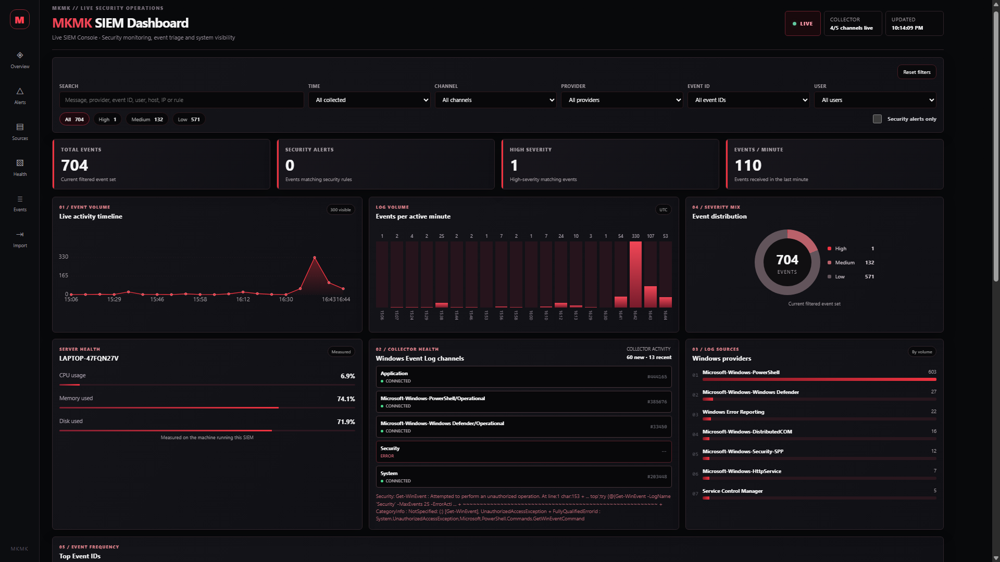
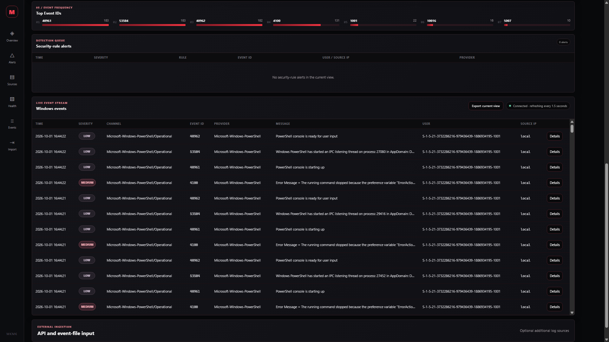

# MKMK Live SIEM

## Overview

MKMK Live SIEM is a local Flask and SQLite security monitoring project for Windows. It does not load a fixed demo dataset. On startup it reads recent records from available Windows Event Log channels, stores them in a separate live database, then continues collecting new records while the dashboard is running.

The dashboard is driven by the current contents of `siem_live.db`. Event totals, security alerts, severity counts, events per minute, timelines, providers, Event IDs, filters, and event tables all change from collected data.

## A useful first investigation

Start the app, wait for the available channels to connect, and open Sources to see what is actually being collected. Choose a channel, narrow the time window, and open Details on an event. The message, record ID, host, and raw fields let you connect a chart total to the evidence behind it. Use Security alerts only when you want rule matches; ordinary operational events remain useful context.

A high-severity event is not automatically a security-rule alert. Windows errors map to High severity, while the separate alert flag records whether a detection rule matched. Treat a rule match as a reason to investigate, not confirmation of an attack.

## Windows data sources

The collector attempts to read:

- Security
- System
- Application
- Microsoft-Windows-Windows Defender/Operational
- Microsoft-Windows-PowerShell/Operational

Channels that are unavailable are shown as unavailable in the dashboard. Reading the Security channel can require an elevated PowerShell session.

The collector imports a small number of the most recent real records on startup so the dashboard has context, then polls for new records every two seconds. Duplicate Windows records are ignored using the channel and Windows Record ID.

## Security rules

The project marks specific Windows events as security alerts, including failed logons, account lockouts, account creation/deletion, privileged-group membership changes, audit-log clearing, service installation, Windows Defender detections, and suspicious PowerShell script blocks. Other Windows records remain visible as telemetry and keep their severity based on the Windows event level.

## Run

From this project directory:

```powershell
python -m pip install -r requirements.txt
python -m src.app
```

Open `http://127.0.0.1:5000`.

The default database is `siem_live.db`, separate from the older `siem.db` used by earlier versions of this project. No sample records are inserted.

Use `python -m src.app --reset` to start with an empty live database. New Windows records will continue to arrive after the collector starts.

Use `python -m src.app --no-windows-events` only when you want to run the interface without the Windows collector.


## Dashboard controls

The compact sidebar links to overview, alerts, sources, measured server health, events and import. Search, time, channel, provider, Event ID, user, severity and alerts-only filters update the view. Reset clears filters. Live/Paused controls automatic refresh. Details opens the raw event. Export current view downloads the visible event rows as CSV. Import accepts JSON, JSONL, NDJSON and CSV. Clearing the store requires confirmation.

Charts use current filtered events; no random values or sample records are inserted. The trend and volume charts show up to 20 active minute buckets. The event table and export show up to 300 matching rows; the alert table shows up to 30. Counts cover the full matching dataset. Server health uses real psutil readings from the machine running the SIEM. Connection loss displays a stale-data notice.

Unavailable or inaccessible Windows channels remain visible and retry. No matching Windows events is a normal empty poll.

## Tests

```powershell
python -m pip install pytest
python -m pytest -q tests
```

The JavaScript control test runs with Node.js when installed and uses a temporary event store. These test fixtures never populate the normal live database. Native Windows Event Log collection must be checked on Windows with the necessary channel permissions.

## Output

### Dashboard overview



### Event stream



These screenshots show the dashboard running on Windows with collected events, measured system health, provider activity, and event triage.

## If the Security channel says unauthorized

`Get-WinEvent: Attempted to perform an unauthorized operation` means the Windows process cannot read that log with its current permissions. The dashboard cannot grant itself access. Stop the app, close VS Code, reopen VS Code using **Run as administrator**, open the same project, and start it with the same virtual-environment interpreter. On a managed device, use the access your administrator permits.

Other readable channels can continue collecting while Security is unavailable. If an operational channel is missing or disabled, the dashboard reports that state and retries. A quiet channel can also return no new events; that is a normal result. Keep the app running on `127.0.0.1`, particularly when using an elevated terminal.

## Import your own events

The API accepts one JSON object or a list. File import accepts a JSON object, a list, an object containing an `events` list, newline-delimited JSON, or CSV. Every record needs nonempty `message` or `event` text. Useful optional fields are `timestamp`, `channel`, `provider`, `event_id`, `username`, `host`, `source_ip`, `severity`, `is_alert`, and `rule_name`.

Use High, Medium, or Low for severity. JSON `is_alert` must be a boolean; CSV accepts true/false or 1/0. CSV rows must match their header width and have unique, nonempty column names. Files must be UTF-8 and fit within the 3 MB request limit. A batch is validated before insertion, so one invalid record does not leave a partially imported batch.

Prefer an explicit ISO 8601 timestamp with a timezone. Times are stored in UTC; a timestamp without an offset is treated as UTC, and a missing timestamp uses ingestion time. Missing descriptive fields receive labels such as `unknown`; those labels indicate missing information. API and file records retain the alert flag you supply rather than automatically running the Windows classification rules.

## Storage and operating limits

`src/windows_collector.py` reads Windows records and maps selected event IDs into explainable alerts. `src/app.py` validates data, queries SQLite, exposes ingestion routes, and measures server health. The HTML template handles refresh, filters, details, and export; the CSS controls the black-and-red layout.

The collector polls channels sequentially, waits two seconds between cycles, and reads at most 100 new records per channel per poll. Slow or inaccessible channels can extend a cycle. PowerShell itself may generate operational events while collecting; these are real activity and can affect provider counts. Startup backfill is limited to 25 recent records per channel, so the project does not promise complete historical coverage after downtime.

Clear removes stored events; it does not clear Windows logs or stop collection. Pause stops browser refresh, while collection continues. The database has no automatic retention policy, so plan for growth and back up evidence before clearing it. Record-ID-based collection can need a restart after a Windows log is cleared; this remains a local learning collector, not a durable enterprise log shipper.

## Troubleshooting

If the page cannot connect, confirm that the terminal still shows the Flask process running and that you opened the configured port. Use `--port 5001` if another application already uses 5000. An empty filtered view can be caused by the time window or another filter, so try Reset filters before assuming collection stopped. Server-health values describe the machine running Flask, not another device viewing the page.

[Return to all projects](../../../README.md)
