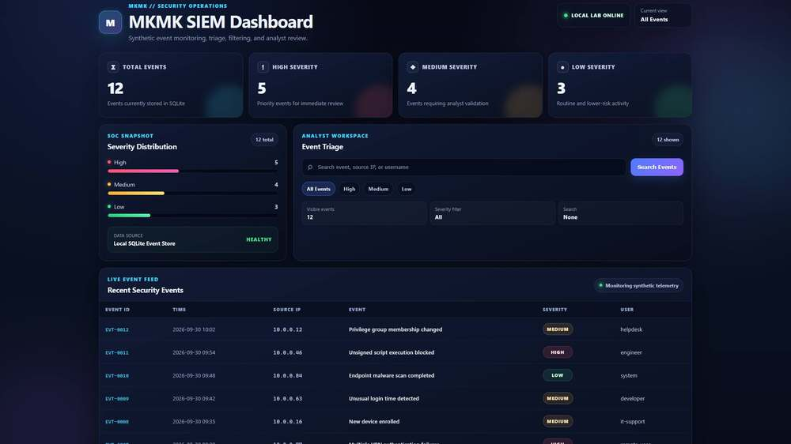

# MKMK SIEM Dashboard

## Overview

MKMK SIEM Dashboard is a local Flask application backed by SQLite. It stores synthetic security events, normalizes severity values, supports text and severity filters, and displays event counts with a readable analyst view.

