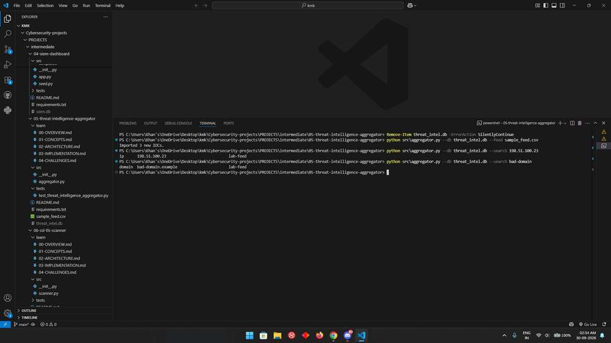

# Threat Intelligence Aggregator

Indicator lists become easier to use when they share one searchable format. This project imports small CSV or JSON feeds into SQLite, keeps duplicates out, and lets you look up an indicator without opening every source file.

## Run it

Open a terminal in this project directory. Use Python 3.12 or 3.13; the repository's [setup guide](../../../README.md#get-started-in-vs-code) explains virtual environments and dependency installation.

```console
python -m src.aggregator --feed sample_feed.csv --db threat_intel.db
python -m src.aggregator --search "198.51.100.23" --db threat_intel.db
```

CSV needs `type` and `value` columns and can include `source`. JSON uses a list of objects with the same fields. Supported types are `ip`, `domain`, `hash`, and `url`. Fields must be text; an omitted or blank source becomes `local`. The bundled feed is a small training fixture, not a current threat feed.

## Read the result

The import count reports newly inserted indicators, not every row read. Importing the bundled feed into an empty database adds three records; importing it again adds zero. A search prints the type, value, and original source for each matching record. `%` and `_` are treated literally rather than as search wildcards.

## How the code works

`read_feed()` parses the entire file and validates its rows before import. `normalise_row()` trims text and normalizes the type name. SQLite enforces uniqueness on `(type, value)`, and parameterized queries perform substring searches. Connections are closed after each operation, and a failed transaction is rolled back.

The [learning notes](learn/00-OVERVIEW.md) explain the concepts, implementation decisions, and tradeoffs in more detail.

## Try a small investigation

Import `sample_feed.csv` twice and compare the counts. Then search for just part of an indicator and inspect the returned source. This separates two concerns: deduplication keeps storage tidy, while the source helps you decide how much weight to give a match.

## Troubleshooting and scope

Use the same `--db` path for import and search. Different terminal directories can otherwise create different databases with the same filename. Invalid JSON, missing feed files, and non-text fields produce a clear command-line error; fix the feed before retrying.

Deduplication is exact for indicator values. It does not canonicalize URL forms or merge source histories: the first stored source remains attached to a duplicate. The tool validates structure, not whether an IP, domain, hash, or URL is a trustworthy indicator. It has no automatic feed updates, confidence scoring, or expiry mechanism.

## Tests

From this project directory, install pytest and run the tests:

```console
python -m pip install pytest
python -m pytest -q tests
```

Tests use controlled inputs and temporary files where needed. They verify the behavior of the configured checks; they do not establish that every real-world threat or configuration is covered.

## Output reference



The command output depends on your input. Use the run instructions above to reproduce a report with your own data.
