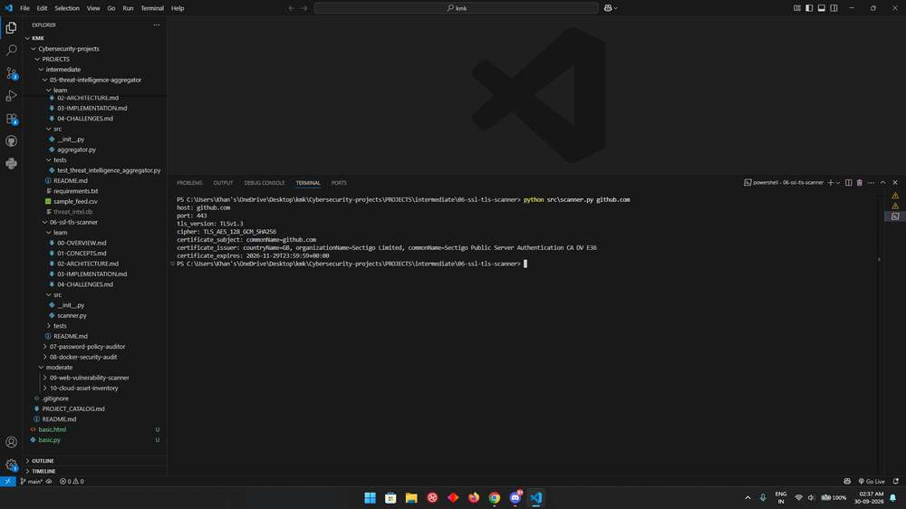

# SSL/TLS Scanner

This tool answers a focused question: what TLS session can this Python client establish with a particular endpoint? It reports the negotiated protocol and cipher along with the server certificate identity and expiry.

## Run it

Open a terminal in this project directory. Use Python 3.12 or 3.13; the repository's [setup guide](../../../README.md#get-started-in-vs-code) explains virtual environments and dependency installation.

```console
python -m src.scanner example.com --port 443 --timeout 5
```

Provide a hostname, not a full URL. The default port is 443 and the default timeout is five seconds. This command makes a real network connection, so its output depends on the endpoint and your network. The implementation uses the Python standard library and needs no project-specific package installation.

## Read the result

A successful run prints the host, port, TLS version, cipher, certificate subject, issuer, and expiry in UTC. A certificate or hostname validation failure stops the inspection. The tool does not silently disable verification to produce a result.

## How the code works

`socket.create_connection()` opens TCP. A default SSL context wraps the connection with the requested server name, preserving SNI and certificate verification. The scanner reads the negotiated session and formats the nested certificate fields into readable text. Certificate times use the SSL parser so the result does not depend on the operating-system language.

The [learning notes](learn/00-OVERVIEW.md) explain the concepts, implementation decisions, and tradeoffs in more detail.

## Try a small investigation

Run against an endpoint you are authorized to inspect, then compare the reported expiry with its certificate details. Repeating the command after a certificate renewal is a useful practical check. A connection failure is also meaningful output: it means no verified session was established.

## Troubleshooting and scope

For timeouts, check the hostname, port, connectivity, and firewall before increasing `--timeout`. If a private lab uses its own certificate authority, configure the appropriate trusted CA in your environment. Do not treat a verification failure as a reason to remove validation from the code.

One successful handshake does not enumerate every cipher or protocol the server supports. A result can also differ across load-balancer nodes, Python builds, or certificate stores. This project does not assign a security grade, test obsolete protocols individually, or replace a full TLS configuration review.

## Tests

From this project directory, install pytest and run the tests:

```console
python -m pip install pytest
python -m pytest -q tests
```

Tests use controlled inputs and temporary files where needed. They verify the behavior of the configured checks; they do not establish that every real-world threat or configuration is covered.

## Output reference



The command output depends on your input. Use the run instructions above to reproduce a report with your own data.
