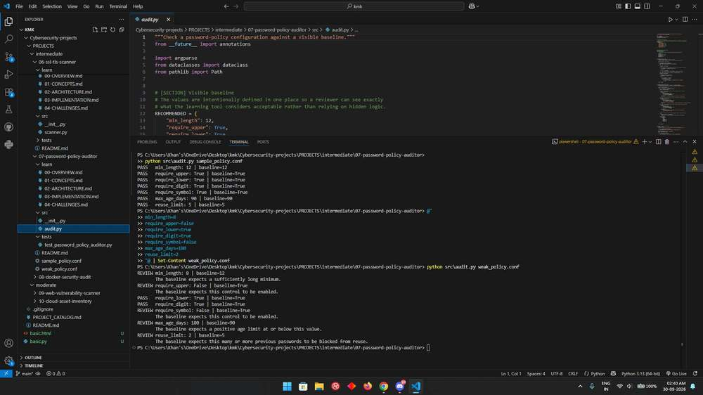

# Password Policy Auditor

This project makes a policy comparison easy to follow. It reads a small configuration file, checks each supported setting against a visible example baseline, and explains which settings need review.

## Run it

Open a terminal in this project directory. Use Python 3.12 or 3.13; the repository's [setup guide](../../../README.md#get-started-in-vs-code) explains virtual environments and dependency installation.

```console
python -m src.audit sample_policy.conf
```

The file uses one `key=value` setting per line. Blank lines and lines beginning with `#` are ignored. Values are integers or `true`/`false`. The bundled policy is a teaching example; the tool does not read or change Windows, Linux, or directory-service password settings.

## Read the result

Each setting is printed as `PASS` or `REVIEW`, alongside its actual value and the example baseline. Missing settings are reviewed rather than assumed to be enabled. A run that reports review items can still finish successfully: the exit status indicates whether the file was processed, not whether every setting passed.

## How the code works

`parse_policy()` turns the text into typed values. `audit_policy()` checks minimum length and reuse history as lower bounds, password age as a positive upper bound, and character requirements as explicit booleans. `PolicyCheck` carries the result and its explanation to the command-line formatter.

The [learning notes](learn/00-OVERVIEW.md) explain the concepts, implementation decisions, and tradeoffs in more detail.

## Try a small investigation

Run the supplied policy, then lower `reuse_limit` to 3 in a copy. Only that setting should change to review if the other values stay the same. This illustrates why different policy fields need different comparison directions, rather than one generic greater-than check.

## Troubleshooting and scope

Use booleans for `require_upper`, `require_lower`, `require_digit`, and `require_symbol`, and integers for the numeric settings. A malformed line identifies its line number. Numeric values such as zero maximum age receive review under this example policy.

The baseline is an illustrative project choice, not a claim of compliance or current best practice. It uses length 12, four character-class requirements, a maximum age of 90 days, and reuse history of 5. Choose a real policy separately for your environment; a passing result here does not measure password strength, MFA, breach detection, or account recovery.

## Tests

From this project directory, install pytest and run the tests:

```console
python -m pip install pytest
python -m pytest -q tests
```

Tests use controlled inputs and temporary files where needed. They verify the behavior of the configured checks; they do not establish that every real-world threat or configuration is covered.

## Output reference



The command output depends on your input. Use the run instructions above to reproduce a report with your own data.
