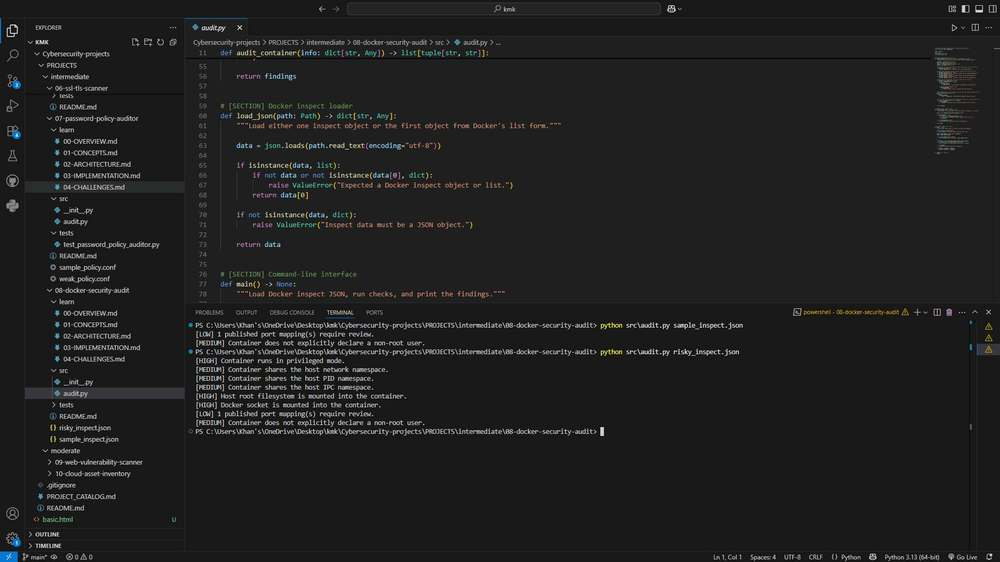

# Docker Security Audit

Container configuration can expose the host in ways that are easy to overlook. This tool reviews saved `docker inspect` output and explains a small set of settings worth checking, without connecting to or changing the Docker daemon.

## Run it

Open a terminal in this project directory. Use Python 3.12 or 3.13; the repository's [setup guide](../../../README.md#get-started-in-vs-code) explains virtual environments and dependency installation.

```console
python -m src.audit sample_inspect.json
```

Use the included fixture to explore the report, or save `docker inspect CONTAINER` output as UTF-8 JSON and pass that file instead. Both a single inspect object and a list of containers are accepted. Every container in a list is reviewed and labeled in the output.

## Read the result

Findings include privileged mode, shared host namespaces, host-root and Docker-socket bind mounts, published ports, and an unspecified or explicitly root user. The sample reports a published port and an unspecified user. The severities are priorities for review, not proof that a container has been compromised.

## How the code works

The loader validates the JSON structure, and `audit_container()` inspects `HostConfig`, `NetworkSettings`, `Config`, and `Mounts`. Both older bind strings and structured bind mounts are checked. A root name or numeric UID zero is recognized even when a group is included, such as `0:1000`. Exposed but unpublished ports are not counted as published mappings.

The [learning notes](learn/00-OVERVIEW.md) explain the concepts, implementation decisions, and tradeoffs in more detail.

## Try a small investigation

Compare the supplied fixture with a copy that sets `Privileged` to `true` or `Config.User` to `root`. Then place both objects in one JSON list. The report should show each container separately and retain the distinct reasons for review.

## Troubleshooting and scope

If Docker is unavailable, you can still review a previously saved inspect file. Invalid nested structures produce an error before a partial report is shown. If no checks trigger, read that as “none of these configured checks matched,” not as a complete hardening assessment.

This is a snapshot review with a small rule set. It does not inspect image vulnerabilities, secrets, effective runtime identities, capabilities, seccomp, or every mount type. A named user cannot be resolved to a UID without inspecting the image. A published port may be intentional; review its bindings and reachability in context.

## Tests

From this project directory, install pytest and run the tests:

```console
python -m pip install pytest
python -m pytest -q tests
```

Tests use controlled inputs and temporary files where needed. They verify the behavior of the configured checks; they do not establish that every real-world threat or configuration is covered.

## Output reference



The command output depends on your input. Use the run instructions above to reproduce a report with your own data.
