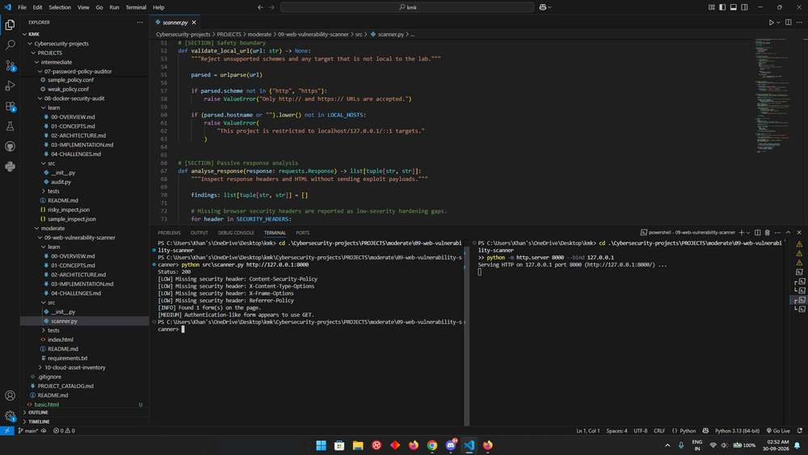

# Web Vulnerability Scanner

This small web checker is designed for a local development lab. It requests one page and points out missing security headers and authentication-like forms that use GET, giving you a manageable starting point for reviewing an application.

## Run it

Open a terminal in this project directory. Use Python 3.12 or 3.13; the repository's [setup guide](../../../README.md#get-started-in-vs-code) explains virtual environments and dependency installation.

```console
python -m src.scanner http://127.0.0.1:8000 --timeout 5
```

Start your own local application first. For a simple header-check demonstration, run `python -m http.server 8000 --bind 127.0.0.1` in another terminal and stop it with Ctrl+C afterward. Accepted hosts are `localhost`, `127.0.0.1`, and `::1`; IPv6 URLs need brackets around the address.

## Read the result

The report starts with the HTTP status, then lists missing configured headers and the number of forms found. Form actions containing login, auth, or password are flagged when the form uses GET. Missing headers on a development file server are expected and provide a useful demonstration of the checks.

## How the code works

The URL validator enforces HTTP or HTTPS and the local-host boundary. Requests fetches one response with a timeout and redirects disabled. Python’s HTML parser reads form method and action attributes without submitting anything. The report checks Content-Security-Policy, X-Content-Type-Options, X-Frame-Options, and Referrer-Policy.

The [learning notes](learn/00-OVERVIEW.md) explain the concepts, implementation decisions, and tradeoffs in more detail.

## Try a small investigation

Serve a local page with `<form method="get" action="/login">` and run the checker. Change the method to POST and scan again. The form count should stay the same while the GET-related finding disappears; missing-header findings depend on the server response.

## Troubleshooting and scope

A connection-refused error usually means the local app is not running on the requested port. A redirect is reported as its original response rather than followed. If your environment uses a proxy, keep local development traffic excluded from that proxy.

Despite the project name, this is a passive page review with narrow coverage. It does not crawl, execute JavaScript, submit forms, test authentication, or send exploit payloads. Header presence alone does not prove that a policy is effective, and action-name heuristics can miss forms with unrelated paths.

## Tests

From this project directory, install pytest and run the tests:

```console
python -m pip install pytest
python -m pytest -q tests
```

Tests use controlled inputs and temporary files where needed. They verify the behavior of the configured checks; they do not establish that every real-world threat or configuration is covered.

## Output reference



The command output depends on your input. Use the run instructions above to reproduce a report with your own data.
