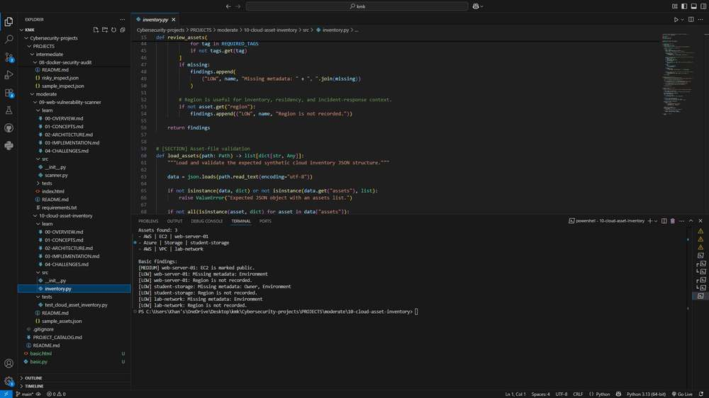

# Cloud Asset Inventory

## Overview

Cloud Asset Inventory reads a synthetic JSON asset export and prints the resources it contains. It flags assets marked public, missing Owner or Environment tags, malformed tag data, and missing region information.

