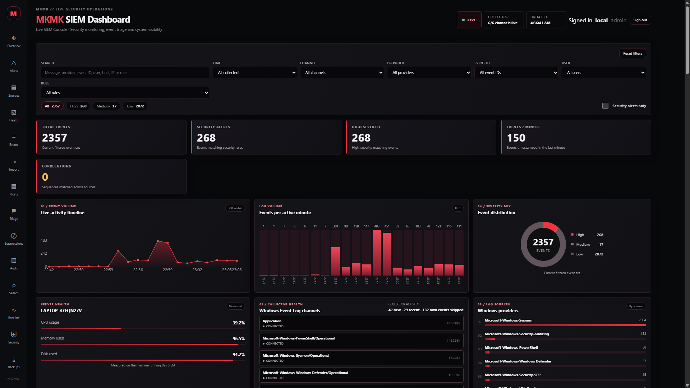
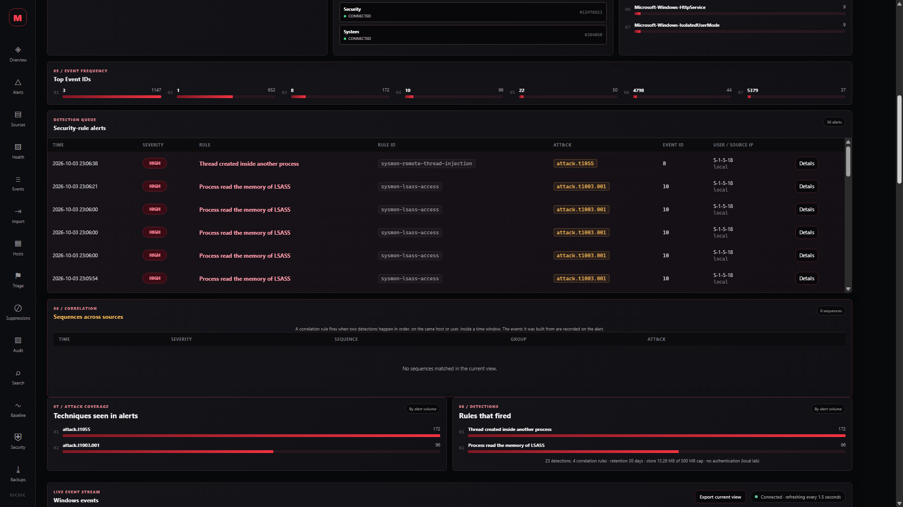
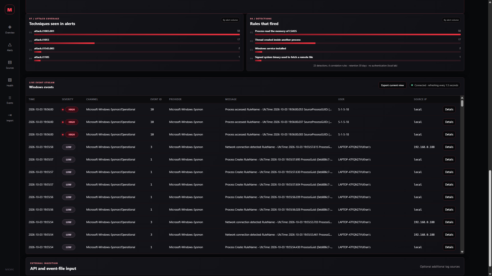
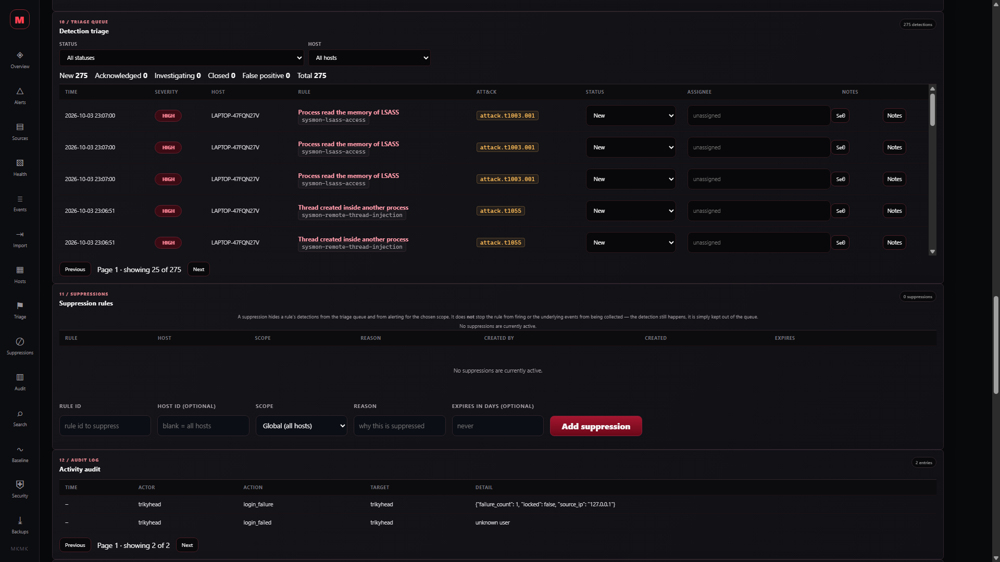
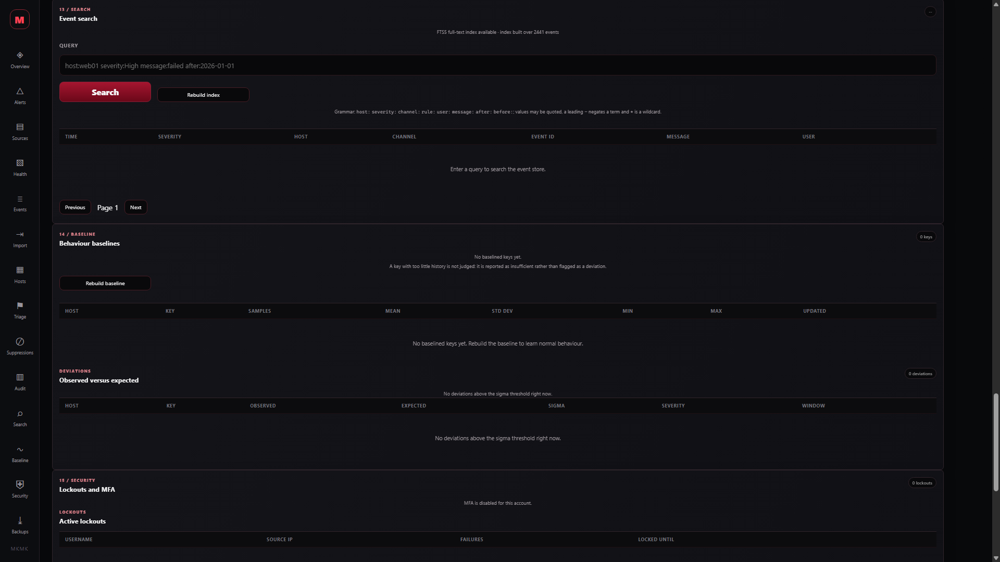
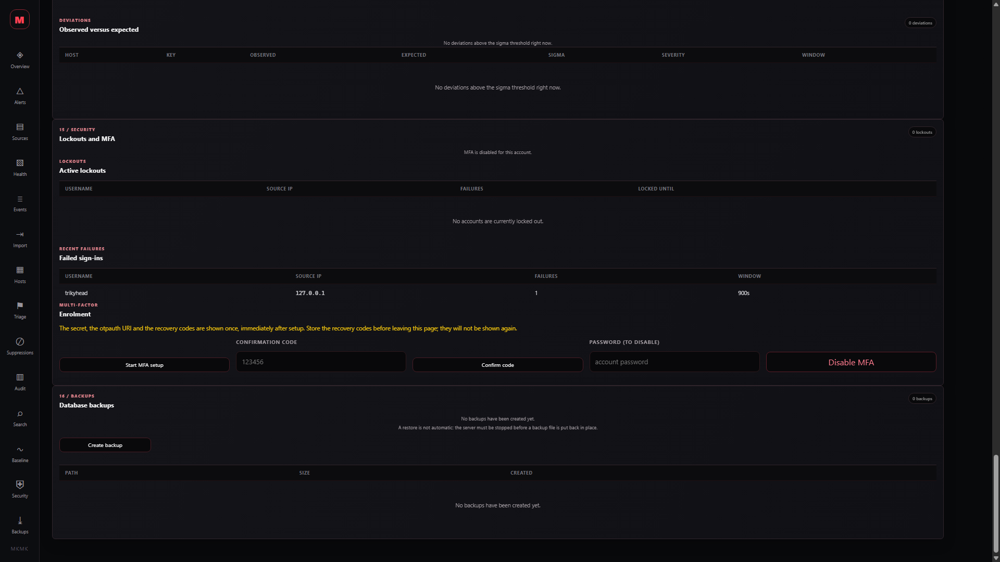
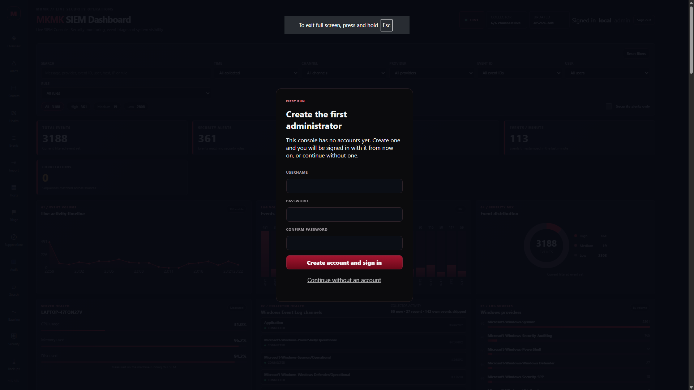

# SIEM Dashboard

This is the largest project here, and the only one that watches live systems. It collects Windows Event Log and Sysmon telemetry from the machine it runs on and from agents enrolled on other machines, classifies each event against rules loaded from files, correlates the results into sequences, stores everything in one SQLite file, and serves a dashboard that has real accounts, a host inventory, an analyst triage queue and an audit trail, all filterable while the data is still arriving.

If you want to see how collection, validation, classification, storage, correlation, triage and an analyst view fit together, start here. If you only want to read a capture file, the traffic tools are a much smaller commitment.

## Running it

```console
python -m src.app
```

That starts the dashboard on `http://127.0.0.1:5000` with a fresh store at `siem_live.db` and begins collecting from the available Windows channels.

Create the first account before you expose the console to anyone. The bootstrap password is read from `SIEM_ADMIN_PASSWORD` or from standard input, never from the command line, because a password in `argv` ends up in shell history and in the process table:

```console
SIEM_ADMIN_PASSWORD='...' python -m src.auth --init-admin analyst --db siem_live.db
```

The console is open on localhost until that first account exists, which is the documented lab default; once any account exists, every protected route requires a session. `--auth-token` still works as well, as a shared secret in front of the account system.

Useful variations:

```console
python -m src.app --db lab.db --port 5001          # different store and port
python -m src.app --reset                          # clear the live store first
python -m src.app --no-windows-events              # run the API without the local collector
python -m src.app --intel-db ../threat-intelligence-aggregator/threat_intel.db
python -m src.app --alert-log alerts.jsonl         # append new alerts as JSON lines
python -m src.app --alert-webhook https://example.invalid/hook
python -m src.app --retain-days 14                 # prune anything older than a fortnight
python -m src.app --auth-token "$SIEM_AUTH_TOKEN"  # an additional shared secret, not an account
python -m src.app --tls-cert cert.pem --tls-key key.pem  # serve HTTPS instead of HTTP
```

Passing both `--tls-cert` and `--tls-key` serves HTTPS; without them the console serves plain HTTP on loopback. The certificate pair is checked when the console starts, so a wrong path or a key that does not match its certificate fails at once rather than on the first connection. Producing the certificate is the operator’s job.

`--no-windows-events` is what you want on macOS or Linux, or on a Windows account that cannot read the security channel: the dashboard, the rule engine, the capture import, the filters and the triage queue all work, they simply have no live local source feeding them. Events from other machines still arrive through an enrolled agent.

An agent on another machine is one command, once the host has been enrolled:

```console
python -m src.agent --server http://siem.example:5000 --host-id web-01 --key hk_... --source windows --interval 30
```


## What it looks like

The page updates from the current contents of the database, so nothing on it is decorative. Counts, severity breakdowns, events-per-minute, timelines, providers, Event IDs, rule hits, ATT&CK techniques, the correlation panel and the event table are all computed from stored records, and the search, time, channel, provider, Event ID, user, rule, severity and alerts-only filters apply to everything on screen.

The console now has eight parts beyond the overview, described at the end of this section: a sign-in view, a monitored-hosts panel, a detection triage queue with an investigation record, a suppression manager with an audit log, and the four wave-two panels — indexed event search, per-host baselining, lockout and multi-factor authentication, and backups. The screenshots below all come from one run on a single laptop, so the numbers are odd and specific; yours will differ, and the panels will not.

### The overview



The top strip answers the first question an analyst asks: **is this thing actually collecting anything?** It reports how many channels are live, when the page last refreshed, and — in the collector panel further down — the state of each channel individually. A channel that is not installed on the machine reads as `not installed` rather than as a failure, and one this account cannot read reads as `access denied`, because neither is a fault in the console.

The filter row is the workspace. Search covers the message, provider, event ID, user, host, address, rule name, rule id and ATT&CK technique in one box, and the dropdowns narrow by time window, channel, provider, event ID, user or rule. The severity buttons carry live counts of what each would show, so you can see the shape of the data before you filter it.

The counters along the top are the summary: total events in the current filter, how many of them matched a rule, how many are High, the rate per minute, and how many correlations have fired. Note that **alerts and High-severity events are different numbers** — an event can be High because Windows called it an error without matching any rule, and a rule can match without raising an alert at all.

Underneath, the volume timeline and the per-minute bars show *when* rather than *what*, the provider ranking shows where the data is coming from, and the severity donut shows the mix. The server-health panel measures the machine running the application, not the machine being monitored, and says so.

### The detection queue



This is the part that makes it a detection pipeline rather than a log viewer. Every row names the **rule that fired**, the **stable rule id** behind it, and the **ATT&CK technique** that rule is tagged with. A reader can disagree with a specific rule instead of arguing with a verdict, and because the id is stable, a rule can be renamed without losing the history of what it fired on.

The Event ID column is the raw Windows or Sysmon event that triggered it. In the screenshot the queue is showing LSASS memory reads, remote thread creation, and a signed system binary used to fetch a remote file — the techniques behind credential dumping, process injection and living-off-the-land downloads respectively. All three are real detections of real events, and all three are also the documented false positives for those rules, which is exactly why the rule files carry a `falsepositives` list: on a normal laptop, that is what these look like.

Below the queue, two rankings answer different questions. **Techniques seen in alerts** shows which ATT&CK techniques your environment is actually producing, which is a coverage view — techniques that never appear are either not happening or not being detected, and the rule files tell you which of those it is. **Rules that fired** shows which of your detections are earning their place, and which are noise you should tune or mark as context.

The correlation panel sits between them. It is empty in this screenshot, and an empty correlation panel is a real result rather than a broken one: no sequence of events matched a rule describing one. When it does fire, the row names the sequence and the host or user it happened on, and the events it was built from are recorded on the alert.

At the bottom of the panel, the runtime line states the current configuration — how many detection and correlation rules are loaded, the retention settings, and whether authentication is on. That line exists so a screenshot of a dashboard can be read without guessing what produced it.

### The live event stream



Everything the rules did not flag is still here. The event table is the raw stream underneath the detections, filterable by the same controls, with the channel, provider, message, user and source address for each record. It is deliberately the largest panel on the page: an alert without the surrounding events is a claim, and the surrounding events are how you check it.

Selecting **Details** on any row opens the record in full: the normalised fields, the rule id and ATT&CK techniques if one matched, **which selections in the rule matched**, any threat-intelligence hit, and the raw event as it arrived. That last part matters. The stored record keeps the original, so a detection can be re-examined later against the data that produced it rather than against a summary someone wrote at the time.

**Export current view** writes exactly the rows on screen to CSV, which is the handover format: what you were looking at, when you were looking at it.

At the bottom, the ingestion panel is where additional sources arrive — a JSON, JSONL or CSV file, a packet capture, or another local collector posting to the API. Those land in the same store as the collected events, which is what makes a network flow and a process event on the same host joinable at all.

### The hosts, triage, suppression and audit panels



**Monitored hosts** lists every enrolled agent with a computed status — `online`, `stale` or `never-reported` — how long ago it was last seen and how many events it has sent. A host that has never reported reads as `never-reported` rather than as a failure, and the status is computed from the last-seen time when the panel is read, so a machine that is switched off stays `online` until the stale window passes.

**Detection triage** is the queue an analyst works. Each row is a stored detection with its status, its assignee and its notes; opening one shows the investigation record, and a note is appended, never edited. A detection moves through `new`, `acknowledged`, `investigating`, `closed` and `false_positive`, and every move is kept in the history.

**Suppression rules** is the tuning loop: a rule hidden for one host or for every host, optionally with an expiry. The panel states plainly that a suppression hides a detection from the queue and does not stop the rule firing or the event being stored.

**Activity audit** lists who did what — logins and failed logins, user and host changes, triage moves, suppressions and revocations — newest first, and is readable only by an admin. The page hides the suppression form and the audit table from a viewer and says why, rather than showing controls the server would refuse. When any of these endpoints cannot be reached, the panel says so instead of showing a zero.

### The search, baseline, security and backup panels



**Event search** is the indexed query language described below, a grammar over hosts, severity, channel, rule, user, source address, message and time, with wildcards, quoting and negation. It shows which engine answered the query, and when the fallback ran it says so rather than implying the search was indexed.

**Baselining** lists what is normal for each host and key, and the deviations panel shows the keys whose recent volume sits furthest above their own baseline, with the observed and expected counts, the standard deviation and the sigma distance. A key with too little history is reported as insufficient rather than judged.

**Lockouts and MFA** shows the accounts currently locked out, the recent failed sign-ins, and the controls to clear a lockout or enrol a second factor. The secret, the otpauth URI and the recovery codes are shown once, at setup.

**Backups** lists the snapshots of the store, with a control to take one now and a control to verify one.



These panels respect the role as the older ones do: a viewer sees the lockout-clear, MFA, rebuild and backup controls hidden, with the reason stated, rather than as buttons the server would refuse.

### Claiming a console



A console with no accounts shows this card rather than a sign-in form, because there is nothing yet to sign in with. Filling it in creates the first administrator and signs you in with it; the link below it leaves the console open on loopback, which is the documented lab default. The card is the only time this console will offer to create an account for you — once one exists the endpoint refuses, and further accounts come from an administrator.

## Detection rules are data, not code

Rules live in `src/rules/*.yml`. Editing a detection means editing a file, not this package, and each rule has a stable id so it can be renamed without losing the history of what it fired on.

```yaml
- id: sysmon-encoded-powershell-command
  title: Encoded PowerShell command line
  level: High
  logsource:
    channel: Microsoft-Windows-Sysmon/Operational
    event_id: "1"
  detection:
    selection:
      event_id: "1"
      data.Image|endswith:
        - "\\powershell.exe"
        - "\\pwsh.exe"
    keywords:
      data.CommandLine|contains:
        - "-enc "
        - "-encodedcommand"
    condition: selection and keywords
  tags:
    - attack.execution
    - attack.t1059.001
```

The format follows the Sigma convention closely enough that a Sigma rule is recognisable, but this engine implements a subset rather than all of Sigma. What is supported:

| Feature | Supported |
| --- | --- |
| `logsource` keys `channel`, `event_id`, `provider`, `source` | Applied as an implicit condition |
| Field modifiers | `contains`, `startswith`, `endswith`, `re`, `cidr` |
| List values | Any-of by default; `\|all` requires every value |
| Condition operators | `and`, `or`, `not`, and parentheses |
| Structured event data | Reachable bare (`CommandLine`) or namespaced (`data.CommandLine`) |
| `alert: false` | Match and record the rule, but do not raise an alert. For rules that describe normal background traffic |
| Anything else | Refused at load time with the file and the reason |

**A rule can match without raising an alert.** `alert: false` is for the rules that describe normal background traffic — a rule that matches every outbound connection would otherwise put hundreds of Medium alerts on the dashboard and bury the queue. The match is still recorded on the event with its rule id, so the rule can be a step in a correlation; it just does not appear in the detection queue on its own. The `/api/rules` response reports which rules alert and which do not.

A rule that cannot be parsed stops the process rather than being skipped. A detection that silently does not load is worse than one that fails loudly.

Rules are evaluated in severity order, so a `High` rule is never masked by a `Low` one that happened to be checked first. The alert records the rule id, the rule name, the ATT&CK techniques and **which selections matched**, so a reader can see why it fired rather than trusting the verdict.

## Correlation

A single-event rule can say "an encoded PowerShell command ran". It cannot say "and then that same host opened a connection somewhere new". Correlation rules do:

```yaml
- id: corr-powershell-then-egress
  type: correlation
  title: Encoded PowerShell followed by an outbound connection
  level: High
  group_by: host
  window_seconds: 120
  steps:
    - rule: win-suspicious-powershell-script-block
    - rule: sysmon-network-connection-to-remote-port
```

The engine groups stored **rule hits** — not only alerts, so a rule marked `alert: false` can still be a step — by host, user or address, looks for the ordered sequence inside the window, and writes a new alert that names the events it was built from. A rule can require fewer steps than it lists (`min_steps`), which is how "three failed logons and then a lockout" is expressed without listing every permutation. Re-running is safe: each correlation alert carries a deterministic external id, so the store's unique index absorbs the repeat.

## Importing a packet capture

```console
curl -F "file=@lab.pcap" http://127.0.0.1:5000/api/pcap
```

A capture is read into **one event per flow** plus one per DNS name, with the packet count and byte count on each flow, and written into the same store as the host events. That is what makes the two joinable: a Sysmon process event and a network flow can be correlated on host and time. Reading a capture needs Scapy; everything else runs without it.

## Threat intelligence

Point `--intel-db` at the SQLite store written by the [Threat Intelligence Aggregator](../threat-intelligence-aggregator) and every event is checked against it as it arrives. An address, domain, hash or URL that matches raises an alert that names the indicator and the feed it came from. An event that was already an alert keeps the rule that fired and records the indicator alongside it, rather than having its reason replaced.

## Accounts, roles and sessions

The console keeps accounts, the host registry, the triage tables and the event store in the same SQLite file, so one file is still the whole console's state.

A console with no accounts is unclaimed, and the page offers to claim it. Rather than a sign-in form it shows a first-run card asking for a name and a password; submitting it creates the first administrator, issues the session in the reply and reloads signed in. The password is held to the same policy as any other account, and a refusal names what was wrong with it.

That door closes behind you. Once any account exists the endpoint refuses, so it is a first-run door and not a way to mint yourself an extra account; later accounts are created by an administrator. Dismissing the card instead leaves the console open on loopback, which is the documented lab default.

For a headless setup, or to create an account without a browser, the same thing is available from the command line, taking the password from `SIEM_ADMIN_PASSWORD` or standard input and never from `argv`:

```console
python -m src.auth --init-admin analyst --db siem_live.db
```

Passwords are hashed with `hashlib.scrypt` (N=2**14, r=8, p=1, dklen=64) with a fresh `secrets` salt per user, and the parameters are stored on the user's own row so they can be raised later without invalidating existing hashes. An unknown username is verified against a dummy hash, so a missing account does not answer noticeably faster than a real one.

There are three roles and one permission matrix, and it is the only place authority is defined:

| Role | May |
| --- | --- |
| `viewer` | Read events and the host inventory. |
| `analyst` | Everything a viewer may, plus triage detections, manage suppressions and export data. |
| `admin` | Everything an analyst may, plus manage users, enrol hosts and read the audit log. |

`has_permission` answers a question; the Flask route must ask it before serving. That separation is deliberate — the matrix lives in one dict, but enforcement is at the route, so a route that forgets to check is not protected by the matrix.

Signing in creates a session: a random token from `secrets`, of which only the SHA-256 hash is stored, with an expiry (twelve hours by default) and a revocation flag. The token is returned to the browser in an HttpOnly cookie. Logging out revokes it, and disabling an account ends its sessions immediately, because a session is only valid while its user still exists and is enabled. A run of failed logins now locks the username-and-address pair out, and an account can require a TOTP second factor; both are described under “Lockout and multi-factor authentication”.

Every function that changes stored state writes an audit row, and both successful and failed logins are recorded. The log is readable at `GET /api/audit`, paged newest-first. It is append-only by convention, not by construction: SQLite does not stop a caller rewriting it and it is not signed.

The console stays open until the first account exists. With no account, nothing is hidden and the page is a plain collector view; that is the documented default for a lab. Once any account exists, every protected route requires a session, while the page itself, `/health`, `/api/me`, `/login`, `/logout` and `/api/ingest` stay reachable without one. `/api/ingest` is reachable because it authenticates with a host key rather than a session.

## Enrolling hosts and running an agent

A host is enrolled by an administrator with `POST /api/hosts`, which returns a one-time plaintext key:

```console
curl -s -X POST http://127.0.0.1:5000/api/hosts -H 'Content-Type: application/json' -d '{"name": "web-01", "platform": "Windows"}'
```

The key is `hk_` followed by 32 bytes of URL-safe randomness. That response is the only moment the plaintext key exists outside the agent, exactly as real agent enrolment works: only a salted PBKDF2-HMAC-SHA256 hash is stored, so a lost key is replaced by rotation, not looked up. A host that is unknown, disabled or presenting the wrong key is refused before anything is stored, and an unknown host and a wrong key return the same reply, so the endpoint does not confirm which host names exist.

One agent runs per machine:

```console
python -m src.agent --server http://siem.example:5000 --host-id web-01 --key hk_... --source windows --interval 30
```

`--source windows` reuses `windows_collector` to read the real Windows Event Log channels on that machine; `--source file` tails a JSONL or CSV file instead (`--file PATH`), which is how a host that is not Windows forwards whatever it can write as lines. Each cycle collects, drains any spooled backlog, ships in batches of `--batch-size` (default 500), and sleeps `--interval` seconds; `--once` runs a single collect-and-ship cycle and exits.

The agent POSTs to `/api/ingest` with `Authorization: Bearer <key>` and a body of `{"host_id", "agent_version", "platform", "events"}`; the server normalises each event through `src/schema.py`, stores what it can and answers `{"accepted", "rejected", "errors"}`. If the server cannot be reached, the events are appended to a bounded JSONL spool (`--spool`, `--max-spool-bytes`) and drained oldest-first on the next successful cycle, so an outage delays delivery rather than losing it.

The agent is a forwarder, not an endpoint agent. There is no installer, no service registration, no privilege separation and no tamper protection, and it does not sign its payloads. Anyone who can edit the agent, its arguments or its spool changes what the server sees, and the bearer key proves that a key was presented, not which machine sent a batch. The spool is ordinary unencrypted text; treat it as a log file that may contain credentials from event messages.

`GET /api/hosts` lists every enrolled host with its computed status, last-seen age and event count. The status is computed when the host is read, not stored: `online` means it has reported and was last seen inside the stale window (five minutes by default), `stale` means it reported before but not since, and `never-reported` means it is enrolled but has never sent an event. That is a self-reported liveness signal — a machine switched off without telling anyone stays `online` until the window passes.

## Triage and suppression

A detection is a stored event with `is_alert = 1`. The triage workflow adds a status, an owner and an investigation record on top of it.

`GET /api/detections` returns the queue, ordered by severity and then newest-first, each row carrying its status and assignee. `POST /api/detections/{id}/status` moves a detection through `new`, `acknowledged`, `investigating`, `closed` and `false_positive`. Every status change appends a row to the transition history, so the path through a detection stays visible after the fact. Notes are added with `POST /api/detections/{id}/notes` and read with `GET` on the same path; they are append-only, with no update or delete, because a note is the record of what an analyst thought and overwriting it would destroy the evidence the workflow exists to keep.

Suppression is the tuning loop. A suppression is a rule scoped to one host or to every host, optionally with an expiry, and it hides that rule's detections from the queue. Expiry is evaluated when the suppression is read, so an expired one stops applying with no cleanup job. Marking a detection `false_positive` only **offers** a suppression; the analyst applies it as a separate, explicit call, so the judgement and the tuning are two decisions rather than one.

Suppression is a workflow convenience, not a guarantee about detection quality. A suppressed rule still fires, still classifies the event, and the event is still stored with its rule id — it is only hidden from the triage queue. Nothing about a suppression changes what the rule engine decides, and suppressing a true positive hides it just as effectively as a false one.

## Searching events

The overview filter’s search box matches a substring across a handful of columns. The **Event search** panel is a different tool: a small query language over an index. A query is whitespace-separated tokens, and a token is free text, a `field:value` clause, or either of those negated with a leading `-`:

| Clause | Filters |
| --- | --- |
| `host:`, `host_id:` | The reporting host’s name and id. |
| `severity:` | `High`, `Medium` or `Low`. |
| `channel:` | The event channel. |
| `rule:` | The rule name or rule id. |
| `user:` | The account in the event. |
| `source_ip:` | The event’s source address. |
| `message:` | The event message. |
| `after:`, `before:` | The event time. `after:` is inclusive, `before:` exclusive; a date with no time is midnight UTC. |

`*` is a wildcard, a value containing a space is quoted (`host:"LAB A"`), and a leading `-` negates a term or a clause. Free text searches the message, rule name, channel, provider, user and host at once.

The query runs against a SQLite FTS5 index kept in step with the store by triggers, and the response names the engine that actually answered it. FTS5 indexes whole tokens, so a free-text term matches a token and a single trailing `*` is a prefix query; a term with an internal `*`, a query with no free text, or a build without FTS5 falls back to indexed-column predicates. The fallback is a scan rather than a full-text index, the response says which engine ran, and the panel prints it, so a search that looks like a full-text search but is not one is visible rather than assumed. Rows that existed before the index was first built are not indexed until the index is rebuilt; a search whose index is behind the store is answered by the scan rather than returning incomplete results, and the summary reports the shortfall.

`GET /api/search?q=&limit=&offset=` runs a query and pages it; `GET /api/search/summary` reports the index state; `POST /api/search/rebuild` (administrator only) repopulates the index from the store. A malformed query is a `400` whose message names the offending token — an unknown field, a missing value, a bare `-`, an unclosed quote or an unreadable date.

Three limits are worth stating. There is no relevance ranking: results are ordered newest-first and the total is an exact count. Tokens are only ever AND-ed, with no parentheses and no `or`. And the index lives in the same SQLite file as the events it copies, so it is not a distributed search service and it does not outlive the store.

## Baselining

Rules match patterns; they cannot say whether an event is unusual *for this host*. Baselining adds that half. `POST /api/baseline/build` (administrator only) computes, for each host and each key, the distribution of that key’s hourly event counts over a window. Two keys are built per host: one per detection rule (the rule id) and one per channel. Each stored baseline carries the sample count, the mean, the standard deviation, the minimum and maximum hourly count, and the first and last observation times.

`GET /api/baseline` lists them with a summary, including how many keys seen in the window have too little history to be judged. `GET /api/baseline/deviations` compares each baselined key’s count in the recent window against `mean + sigma * stddev` and returns the keys above it, each carrying the observed count, the expected count (the mean), the standard deviation, the sigma distance and a severity.

Two design choices matter. **A key with fewer than the minimum samples — 24 by default, a day’s worth of active hours — is reported as having insufficient history and is never judged**, because a standard deviation from a handful of hours is noise. And **hours in which a key produced no events are excluded rather than counted as zero**, so a host that is switched off at night does not drag its own mean down; the cost is that a key firing for the first time in a previously silent hour is not, by itself, a deviation.

The honest limits belong here too. It is a simple per-key statistic: it knows nothing about correlation between keys, so a burst spread thinly across many keys is invisible; it counts volume, not intent, so an attack that stays inside normal volume is never reported; and a host quiet for most of the week produces a low baseline that ordinary daytime activity can sit above. It is a separate signal and does not feed back into the rule engine — a rule alerts exactly as it did before.

## Lockout and multi-factor authentication

Signing in now has two brakes beyond the scrypt cost. **Lockout:** five failed logins within fifteen minutes lock that username-and-address pair out for fifteen minutes. A locked pair is refused *before* the password is checked, so a lockout cannot be used as an oracle for guessing; the lockout expires on its own with no timer and no administrator, and an administrator can clear it with `POST /api/security/lockout/clear`. A successful sign-in clears the failure run for that pair.

**Multi-factor authentication** is TOTP per RFC 6238, a six-digit code on a thirty-second step with a one-step drift window either side. `POST /api/mfa/setup` returns the secret, the `otpauth://` URI and ten one-time recovery codes, and that is the only moment any of them exists in plaintext: only the SHA-256 hashes of the recovery codes are stored, so a copy of the database holds no usable recovery code. `POST /api/mfa/confirm` verifies a code against the pending secret and enables the factor; `POST /api/mfa/disable` turns it off and **costs the account password**, because turning a second factor off is a downgrade. A login now accepts an optional `code` field and replies `mfa_required` when the password was right but a code is needed.

`GET /api/security` lists the active lockouts and the recent failed sign-ins. The honest limits: TOTP protects the login step only, not a session token once issued; the secret sits in plaintext in the same SQLite file as everything else, so anyone who can read the file can generate valid codes; and the lockout is per username-and-address, not global, so an attacker with a pool of addresses still gets the threshold from each, and someone who knows a username can lock that user out from their own address.

## Backups

`GET /api/backups` lists the snapshots in the store’s backup directory; `POST /api/backups` takes one; both it and `POST /api/backups/verify` are administrator-only. Snapshots are taken with SQLite’s own online backup API rather than by copying the file, because the store runs in WAL mode and a plain copy can miss committed data still sitting in the write-ahead log; the snapshot is a single self-contained file with no `-wal`/`-shm` beside it. Verification runs `PRAGMA integrity_check` and counts the rows in every table, so a truncated or corrupt file is detected rather than trusted, and the verify route refuses any path outside the directory the console writes backups to, so it cannot be pointed at an arbitrary file on the machine.

`restore_backup` lives in the module and is not on the HTTP surface. It refuses to overwrite an existing database without an explicit force, and when forced it takes a safety copy of the current file first. Stated plainly: this is a file-level snapshot, not replication and not high availability; a restore needs the server stopped, because SQLite will not let a live connection’s database be overwritten underneath it; and the backup directory is not encrypted, so a snapshot holds the same sensitive events as the store.

## Serving HTTPS

The console serves plain HTTP unless it is started with both `--tls-cert` and `--tls-key`, in which case Flask serves HTTPS. The certificate pair is validated at start-up, so a wrong path or a key that does not match its certificate fails immediately with a sentence rather than on the first connection with a traceback. The session cookie is marked `Secure` only when the console is actually on HTTPS, because a `Secure` cookie that can never be sent over plain HTTP would lock an operator out of their own lab. Generating the certificate is the operator’s job; the console does not produce one. TLS is opt-in, so the default remains plain HTTP on loopback.

## The event schema

Every source produces events in a different shape, so `src/schema.py` defines one canonical record and maps each producer onto it. The record has seventeen fields — `timestamp`, `host_id`, `source`, `event_type`, `severity`, `message`, `user`, `process`, `command_line`, `src_ip`, `dst_ip`, `dst_port`, `dns_query`, `file_hash`, `rule_id`, `techniques` and `raw`. Only `message` is required; every other field has a documented default, and a field the source does not supply is `None` rather than a placeholder. The producer strings `"unknown"` and `"localhost"` are normalised to `None` so a consumer can tell a known value from an absent one, and unknown input fields survive in `raw`, so nothing a source sent is lost.

There are four mappers, auto-detected from the record when the caller does not name one: `windows-event-log`, `sysmon`, `pcap-flow` and `generic-json`. The Sysmon channel is checked before the declared source, because the Windows collector labels a Sysmon payload `windows-event-log` while the channel says otherwise. `GET /api/schema` returns this description so the page can document itself.

## Retention, alerting and authentication

- **Retention, by age and by volume.** `--retain-days` prunes events older than the window; `--max-db-mb` deletes the oldest events once the store passes a size. Whichever limit is reached first wins, and both are off at `0`. The age default is 30 days and the size default is 500 MB. Both are needed: Sysmon on a working laptop produced about 63 events a minute after tuning, which is 91,000 a day and roughly 6.8 GB over a 30-day window — a problem the age limit alone never sees. The current size and the cap are reported on the dashboard. Correlation alerts expire with the events they were built from, because a sequence finding is only checkable while its events are still there.
- **Alerting.** `--alert-log` appends every alert as a JSON line; `--alert-webhook` POSTs it. `--alert-min-severity` sets the floor (default `Medium`). A webhook that fails is recorded and shown on the dashboard rather than stopping collection.
- **Authentication.** `--auth-token`, or the `SIEM_AUTH_TOKEN` environment variable, requires a bearer token on every route, in addition to the account system described above. When a token is set, open the page as `/?token=...` and it will authenticate its own requests.


## Routes

| Route | Purpose |
| --- | --- |
| `GET /health` | Confirms the app is up, and reports the rule, indicator and auth counts. |
| `GET /api/dashboard` | The whole dashboard snapshot, with every filter accepted as a query parameter. |
| `GET /api/rules` | Every loaded detection and correlation rule, its ATT&CK techniques and its documented false positives. |
| `GET /api/measurement` | The measured accuracy of every rule against the corpus captured on this machine, plus the anomaly detector's result. Explains itself when there is no corpus. |
| `GET /api/schema` | The canonical event schema, so the page can document itself. |
| `GET /api/me` | The signed-in user's name and role, or 401. |
| `GET /api/setup` | Whether this console still needs its first account. |
| `POST /api/setup` | Create the first administrator and sign them in. Refused once any account exists. |
| `POST /login`, `POST /logout` | Start and end a session. |
| `POST /api/events` | Ingest one event object or a list of them. |
| `POST /api/ingest` | Accept a batch from a collector agent, authenticated by host key. |
| `POST /api/import` | Upload a JSON, JSONL, NDJSON or CSV file (3 MB limit). |
| `POST /api/pcap` | Upload a `.pcap`, `.pcapng` or `.cap` capture. |
| `POST /api/correlate` | Run the correlation rules over stored alerts now. |
| `POST /api/events/clear` | Empty the live store. |
| `GET /api/hosts` | Every enrolled host with its status, last-seen age and event count. |
| `POST /api/hosts` | Enrol a host and return its one-time key. Admin only. |
| `GET /api/detections` | The triage queue, filtered and paged. |
| `POST /api/detections/{id}/status` | Move a detection to a new status. |
| `GET`, `POST /api/detections/{id}/notes` | Read or append a detection's investigation notes. |
| `GET`, `POST /api/suppressions` | List or create a suppression. |
| `DELETE /api/suppressions/{id}` | Revoke a suppression. |
| `GET /api/audit` | The audit log, newest first, paged. |
| `GET /api/search/summary` | The search index state: FTS5 availability, indexed rows and whether the index is behind. |
| `GET /api/search` | Run a query-language search, paged, reporting which engine answered. |
| `POST /api/search/rebuild` | Rebuild the FTS5 index from the store. Admin only. |
| `GET /api/baseline` | The stored per-host baselines and a summary of what cannot be judged. |
| `GET /api/baseline/deviations` | Baselined keys whose recent count exceeds their own mean plus sigma. |
| `POST /api/baseline/build` | Recompute the per-host baselines. Admin only. |
| `GET /api/security` | Active lockouts and recent failed sign-ins. |
| `POST /api/security/lockout/clear` | Clear a lockout. Admin only. |
| `GET /api/mfa` | Whether MFA is enabled for the signed-in user. |
| `POST /api/mfa/setup` | Begin MFA enrolment; returns the secret, URI and recovery codes once. |
| `POST /api/mfa/confirm` | Confirm enrolment with a code. |
| `POST /api/mfa/disable` | Turn MFA off; costs the account password. |
| `GET /api/backups` | List the backups in the store’s backup directory. |
| `POST /api/backups` | Take a snapshot. Admin only. |
| `POST /api/backups/verify` | Verify a snapshot written by this console. Admin only. |

Bad input comes back as JSON with a 400 and a sentence explaining the problem, never as an HTML error page: a missing message field, a severity outside High/Medium/Low, a CSV whose rows do not match the header width, a deeply nested JSON document, a `since` value that is not a whole number of minutes, or a file that is not a capture. A batch is validated before insertion, so one bad record does not leave half an import behind.

## How the collector works

`windows_collector.py` is used in two places. The console's own collector reads the machine it runs on; the agent's `--source windows` mode reuses the same reader to forward another machine's channels, so both produce the same payload shape. The module reads records from the channels it can reach, converts each one into a payload, and hands it to the ingestion pipeline. Classification is not decided in the collector: the payload goes to the rule engine, so a detection changes by editing a rule file.

The channels are `Security`, `System`, `Application`, `Microsoft-Windows-Sysmon/Operational`, Windows Defender and PowerShell. **Sysmon is the one that matters most**, because it records the command line of a new process, the process that started it, and the connections it makes. The Security log tells you an account logged on; Sysmon tells you what ran and what it talked to.

Records are deduplicated on the way in, and the collector keeps retrying a channel that is temporarily unavailable instead of giving up.

Each channel reports one of five states, and only the last of them is a problem with this application:

| State | Meaning |
| --- | --- |
| `connected` | Records are being read. |
| `waiting` | Not polled yet. |
| `missing` | The log does not exist on this machine. Sysmon shows this until Sysmon is installed. |
| `denied` | The log exists but this account cannot read it, which is common for `Security` on a managed machine. |
| `error` | A genuine failure. Only this state raises the summary line. |

Seeing fewer live channels than a colleague is normal and does not mean the app is broken.

**The collector excludes its own output.** Reading a channel means running PowerShell, and a running PowerShell writes to the PowerShell channel — so without a filter the monitoring tool becomes the loudest thing in its own store. Measured on a quiet workstation before this was fixed: 717 of 819 stored events were PowerShell console lifecycle records produced by the collector's own child processes, about nine in ten.

Every PowerShell process the collector starts has its process id recorded, and records from those processes are counted and skipped. The dashboard reports the count next to the collector activity line, so the exclusion is visible rather than silent. Process ids are remembered to a bounded depth, because Windows reuses them.

Two places have to be checked, and installing Sysmon is what made the second one obvious. A Windows channel record carries the process that raised it in the record header. A **Sysmon** record carries Sysmon's own process id there, and names the process the event is *about* in the event body — so a naive header check misses every Sysmon event about the collector's own children, and 87 of the first 107 process-creation events were the collector's PowerShell. The structured fields `ProcessId`, `SourceProcessId` and `ParentProcessId` are checked as well.

## Measuring the rules instead of assuming them

A rule that reads sensibly is not the same as a rule that works, and the
difference only shows up when something is run past it whose answer you already
know. So the rules are measured against a corpus captured on this machine, where
every window of telemetry is labelled with the technique that was running during
it. The labels come from the run rather than from the telemetry, which is what
makes them worth anything: nothing in the events themselves says which technique
produced them.

The techniques are Atomic Red Team's, narrowed to a list held in `src/lab.py`.
That narrowing is the point of the file. The atomics tree contains tests under
the same technique identifiers that download and execute PowerShell from a URL,
and they are excluded permanently; what is left is read-only reconnaissance —
listing processes, reading the system information, asking who you are. The
command text lives in the file rather than being read from the tree at run time,
so the tree is the source and the file is the decision about it. Each entry names
the atomic it came from, a test asserts that no allowed command reaches the
network or changes the machine, and the capture refuses to write a corpus at all
if a channel could not be read — because a corpus missing Sysmon while looking
complete is the worst possible failure for something whose whole job is to
produce a number you can trust.

`src/measure.py` then scores every rule against every window. The unit is the
window rather than the event. A technique happens over a few seconds and leaves
dozens of events behind, so counting events would let one noisy technique
outweigh a quiet one and would make "recall" mean something no analyst would
recognise. Each window is scored once per rule: a rule firing somewhere in a
window labelled with a technique it names is a true positive, a rule firing in a
window labelled with something else is a false positive, and a rule naming a
technique whose window it never fires in has missed it. That definition is
deliberately strict. A rule that fires on *anything* would otherwise score
perfectly, and flattering every rule in the set is exactly what measuring them is
supposed to prevent.

The first measurement was wrong, and the way it was wrong is worth recording.
The scoring passed the raw event to the matcher, which expects the flattened
mapping that `event_fields` builds -- structured EventData is exposed there both
bare and namespaced as `data.<Key>`, and the rules use the namespaced form. So
every `data.` lookup resolved to the empty string and no rule could match
anything. Worse, the two rules that appeared to fire did so only because a `not`
clause passed on the field that was missing: a rule whose condition is "a
connection that is *not* loopback" matches every event when the destination is
not there to read. The result was a rule set that detected nothing and a
network rule that looked like it fired on everything, both of them artefacts.

Corrected, and with the discovery rules added, the picture is different. Five
rules now detect the discovery techniques they were written for, at full
precision and with recall between one half and complete. Three rules carry false
positives, and they are the three worth tuning: `sysmon-network-connection-to-remote-port`
fires in every window it is shown, which its own comment already admitted and the
measurement now confirms with a number, and `sysmon-lsass-access` and
`sysmon-remote-thread-injection` fire in six windows each. None of those three is
wrong to exist -- the network rule is explicitly context rather than an alert --
but the measurement says which of them would fill a queue.

`src/anomaly.py` is the other approach, for the techniques no rule covers. It is
an isolation forest written out rather than imported — the algorithm is a page of
arithmetic and a detector whose decision can be read back to a path length is one
a reader can argue with. It trains on the **benign windows only** and is then
asked about windows it has never seen, because training on the whole corpus would
be scoring the model on what it was taught. It separates attack windows from
benign ones, and it survives the evasion test: replaying the technique windows
with their features replaced by values drawn from the benign distribution, and
burying them in a flood of ordinary events, degrades it but does not break it.
The caveat belongs in the same sentence as the result — it flags well over half
of the benign events as anomalous, so it is a detector that finds the signal and
far too much else, and it is not something to deploy without a great deal of
tuning.

All of this is in the console, under **How well the rules actually do**. When
there is no corpus on the machine the panel says so and names the command that
would capture one, because an empty table reads as a fault rather than as an
experiment nobody has run yet. The captured corpus is not committed: it is real
telemetry from a real machine, hostname and account name included, and it belongs
on the machine that produced it.

## Limits

Three rules fire on traffic they were not written for, and the measurement says
which: `sysmon-network-connection-to-remote-port` matches a connection in every
window it is shown, benign ones included, and `sysmon-lsass-access` and
`sysmon-remote-thread-injection` match in half of them. The first is declared
context rather than an alert, so it does not fill the queue, but it also does not
discriminate.

The anomaly detector does not work, and the reason is worth more than the result.

The first feature set described an event's *shape* -- its id, its channel, its
message length, whether its image sat in System32 -- and it scored the technique's
own events as more normal than background activity. That is not a tuning problem,
it is the features being wrong: living-off-the-land discovery runs `cmd.exe` and
`powershell.exe` out of System32, so a feature that calls System32 benign calls
the technique benign too. It rewarded the attacker.

The features were replaced with ones that read what the command line says, and
the detector still could not see the techniques -- because of a property of the
model rather than of the data. An isolation forest is trained on the benign
events, and the benign events contain no discovery verbs, so that feature is
constant in training and **never chosen for a split**. The axis that carries the
signal is invisible to the model by construction, however loud it is at scoring
time. A detector built this way can only flag points that are extreme along axes
it saw vary, and the axis that matters is one it never saw vary at all.

A command language model was added for exactly that reason: it learns the
vocabulary and transitions of the commands this host normally runs and reports how
surprising a new one is, so a word nobody has used before is visible to it. It
could not be measured on this corpus either, and that is the finding underneath
both failures.

**The corpus's benign windows contain no process creation at all.** Forty-five
benign events, every one of them a network connection, a PowerShell script block
or a Defender record, and not one with a command line. The technique's events all
have one. So there is no baseline of ordinary commands for either model to learn
from, and the question the detector was asked -- is this command unusual for this
host? -- cannot be answered from data in which the host never ran a command.

The fix is in the capture rather than in the model: a benign window has to be
captured during genuine ordinary activity that includes process creation, because
a window in which nothing runs is not a baseline, it is an absence.

Read this before treating a clean dashboard as a clean machine.

- **TLS is opt-in.** The console serves plain HTTP unless it is started with `--tls-cert` and `--tls-key`, so the default is cleartext on loopback, and passwords and session cookies cross the network in cleartext the moment it is bound to anything but localhost without those flags. The session cookie is marked `Secure` only when the console is actually on HTTPS. Sessions are only as safe as the transport that carries them.
- **Roles are enforced by the routes, not the database.** `auth.has_permission` answers a question; the Flask route has to ask it. A route that forgets to check is not protected by the permission matrix, and the matrix is one Python dict rather than a database-enforced policy.
- **Sessions are bearer tokens.** The cookie is `HttpOnly` and `SameSite=Lax`, but anyone who can read the cookie or the token can use the session until it expires or is revoked. A second factor protects the login step, not a session that has already been issued, so it does nothing for a stolen cookie.
- **The TOTP secret lives in the same file as the data.** MFA is stored as a plaintext base32 secret in the same SQLite file as the events, accounts and everything else, so anyone who can read the database can generate valid codes and anyone who can write it can disable the factor. It guards against a stolen password, not against an attacker who already has the file.
- **Lockout is per username-and-address.** Five failures lock a username-and-address pair, not the account globally, so an attacker with a pool of addresses still gets the threshold from each, and an attacker who knows a username can lock that user out from their own address.
- **The console is open until the first account exists.** With no account, the protected routes are reachable on localhost without a session and identity is reported as an implicit local administrator rather than refused, so the page offers to create the first account instead of a form nothing could satisfy. That is the documented lab default, and it means the first thing to do before binding to anything but loopback is create an admin.
- **The agent cannot be trusted about which machine it is.** The bearer key proves that a key was presented, not which machine sent a batch. The agent has no installer, no service registration, no privilege separation, no tamper protection and no payload signing, so anyone who can edit the agent, its arguments or its spool changes what the server sees. The key is the whole of its identity.
- **The agent spool is unencrypted plain text.** Events that could not be shipped, including any credentials that were in their messages, sit in a JSONL file until delivered. Treat it as a sensitive log file.
- **Suppression is a workflow convenience, not a detection-quality guarantee.** A suppressed rule still fires, still classifies the event, and the event is still stored with its rule id; it is only hidden from the triage queue. Suppressing a true positive hides it as effectively as a false one.
- **The baseline cannot see an attack inside normal volume.** Baselining now records what is normal per host and per key, but it is a volume statistic: a key that always fires a hundred times an hour has a high mean, and an attacker who stays under it is never reported. It knows nothing about correlation between keys, and it does not feed back into the rule engine, so the noisiest rules still record themselves as context rather than raising alerts.
- **The search fallback is a scan, not a full-text index.** The query language runs against an FTS5 index when the build has one and the index is in step, but it falls back to indexed-column predicates whenever FTS5 is unavailable, the index is missing or behind, the query has no free-text terms, or a term uses an internal wildcard. The two engines are not identical — the scan matches substrings where FTS5 matches tokens — so the same query can return different rows on two machines, and the response names the engine that actually ran rather than hiding the difference.
- **The store is a single SQLite file in a single process.** Events, accounts, hosts, triage state, baselines and the audit log all live in one file served by one process. There is no replication, no hot/warm/cold tiering and no high availability; a backup is a file-level snapshot, not a second copy kept in step.
- **The backup directory is not encrypted.** A snapshot is an ordinary SQLite file holding the same events, password hashes and TOTP secrets as the store, protected only by the filesystem’s permissions. It is not shipped off the host and it is not encrypted.
- **A local lab console, not a hardened service.** The Flask development server is not designed to face a network you do not control, and the agent is a forwarder rather than an endpoint agent. Nothing here is a substitute for a hardened production service.
- **Rule coverage is a documented subset of Sigma.** Unsupported keys are refused rather than ignored, so a rule that loads is a rule that works, but a Sigma rule using an unsupported feature will not load as-is.
- **Correlation is sequence-only.** Ordered steps on a single grouping field inside a time window. There are no thresholds, no joins across fields, and it does not consult the baseline — a correlation rule cannot say a sequence is unusual for a host, only that it happened.
- **Several rules are noisy by design and marked as context.** The outbound-connection rule matches normal traffic, so it records rather than alerts. The baseline is a separate signal and does not change how a rule alerts, so treating the behaviour as context is still the honest option instead of pretending a browser is an incident.
- **Severity is not risk.** A severity on an alert is how much attention the rule thinks it deserves, not a measure of business impact. There is no asset criticality and no risk scoring.
- **Sysmon is a large source.** Even tuned, it is the bulk of the store — 1,031 of 1,157 events in one measured run. That is the nature of endpoint telemetry, and it is why the store is bounded by size as well as age.
- **The collector reads the log by running PowerShell.** Six channels are polled every two seconds, one process each. That works and it is what the platform gives without an extra dependency, but it is heavy, it produces the self-generated volume described above, and a machine with a slow PowerShell profile will poll slowly. A native API would be the right long-term answer.


## Tests

```console
python -m pytest -q tests
```

581 tests pass, two skipped. The suite covers empty startup, Windows and Sysmon event mapping, rule loading and matching, the condition operators, severity ordering, context rules that record without alerting, correlation sequencing and its window, grouping and step count, capture parsing into flows, threat-intelligence matching, retention by age and by volume, schema migration from an older store, notification, the collector's exclusion of its own processes, the channel-state classification, the API surface, the `since` bounds, and the JavaScript controls exercised in Node against a temporary API. It also covers the account and role model, the host registry and enrolment keys, the agent's batching, spool and file tailing, the triage status machine, append-only notes, suppression scoping and expiry, and the canonical event schema. The wave-two work has its own suites: the query grammar, the FTS5 index and the scan fallback, the baseline build and deviation maths with its minimum-sample guard, the lockout window and its expiry, TOTP against the RFC vectors plus the recovery codes, the backup snapshot, verify and restore, the TLS pair validation, and the wave-two routes through the HTTP surface. The two skips are the TLS tests that shell out to `openssl` when the temporary directory cannot be used. A separate test reads real System events on Windows and is skipped elsewhere.
